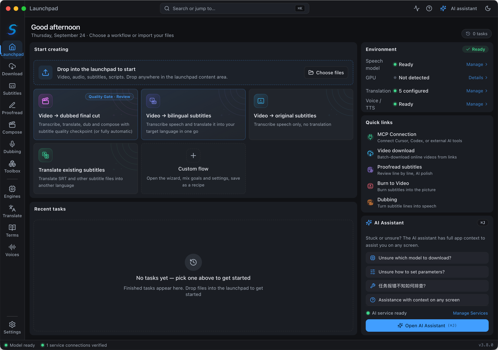
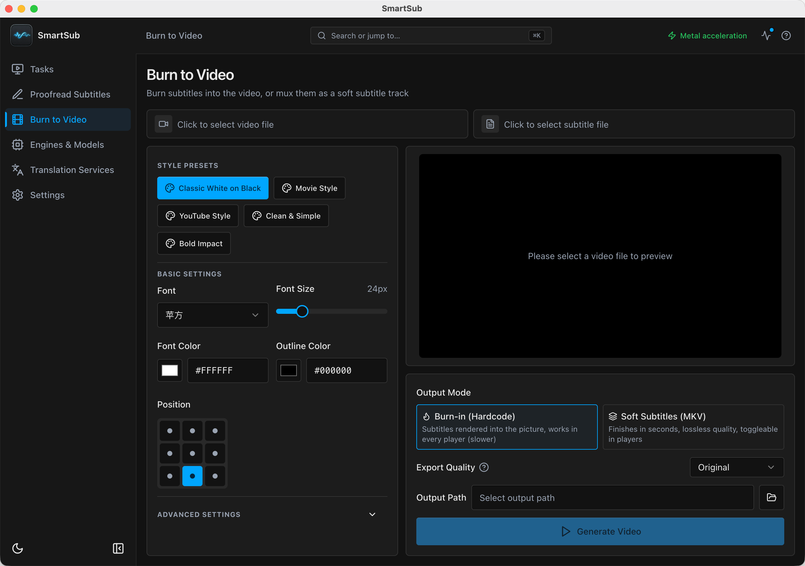
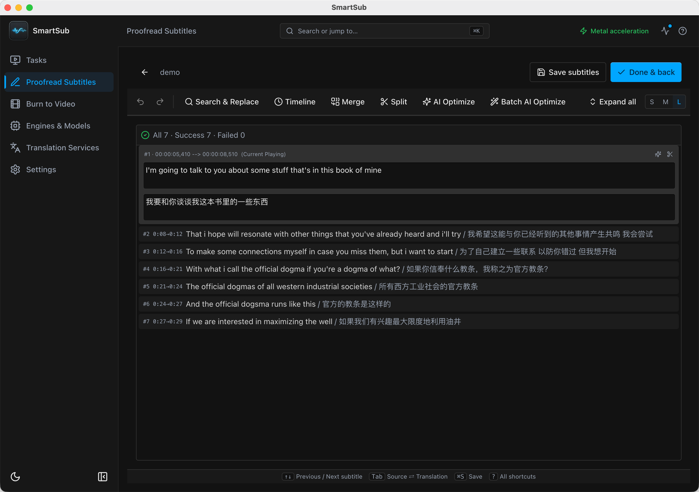

<div align="center">


# SmartSub

**Generate, translate, dub, and burn subtitles with built-in AI Assistant & MCP/CLI automation — an all-in-one open-source desktop app**

Make every frame speak beautifully

<a href="https://trendshift.io/repositories/14079?utm_source=repository-badge&amp;utm_medium=badge&amp;utm_campaign=badge-repository-14079" target="_blank" rel="noopener noreferrer"></a>
<a href="https://trendshift.io/repositories/14079?utm_source=trendshift-badge&amp;utm_medium=badge&amp;utm_campaign=badge-trendshift-14079" target="_blank" rel="noopener noreferrer"></a>

[](https://github.com/buxuku/SmartSub/releases/latest)
[](https://github.com/buxuku/SmartSub/releases)
[](https://github.com/buxuku/SmartSub/releases)
[](https://github.com/buxuku/SmartSub/blob/master/LICENSE)

[中文](README.md) | [English](README_EN.md) | [日本語](README_JA.md)

[Download](#download-and-install) · [Features](#features) · [AI Assistant & Automation](#-ai-creative-assistant-in-app-copilot) · [Free Workflow](#a-completely-free-workflow) · [FAQ](#faq) · [Changelog](https://github.com/buxuku/SmartSub/releases)

</div>



## What is SmartSub?

SmartSub is an open-source subtitle and dubbing tool that packs the whole pipeline — **speech-to-text → subtitle translation → proofreading → AI dubbing → burn-in** — into one desktop app, with a built-in online video downloader: paste a YouTube / Bilibili link and the source video is fetched for you. Transcription runs on local models (whisper.cpp, sherpa-onnx and more), so your files never leave your machine. It handles batch jobs, accelerates on NVIDIA / AMD / Intel / Apple Silicon GPUs, and runs on Windows, macOS, and Linux.

SmartSub deeply integrates modern AI copilot and agentic automation capabilities:
- **In-App AI Creative Assistant (Copilot)**: Toggle anytime via keyboard shortcut with deep workspace context awareness, multimodal screenshot diagnostics, real-time undoable subtitle editing, and agentic tool execution using natural language.
- **MCP Protocol & CLI Automation**: Full Model Context Protocol support with 111 production-grade tools and matching CLI commands. Ships with its own Electron/Node runtime (zero external Node.js config required), connecting seamlessly with Cursor, Claude Code, OpenAI Codex, and headless automated scripts.

**The entire pipeline can run at zero cost**: local Whisper transcription, built-in free translation sources, local TTS dubbing with voice cloning, and local ffmpeg burn-in — no API keys required, no usage caps on local processing. When you want more, plug in any of 20 translation services, 9 cloud transcription providers, and 6 cloud TTS services.

## What can it do for you?

| Your goal                                     | How SmartSub handles it                                                                    |
| --------------------------------------------- | ------------------------------------------------------------------------------------------ |
| Polish subtitles & troubleshoot with AI       | Summon the in-app AI assistant anytime with workspace context & vision screenshot diagnostics; rephrase dialogue, fix jargon, or dispatch tasks hands-free |
| Automate workflows with Cursor / Claude / CLI | Use 111 MCP tools & CLI commands to let external AI agents or terminal scripts transcribe, translate, dub, and burn videos automatically |
| Watch foreign videos or lectures without subs | Drop in the video, transcribe locally, translate — get bilingual subtitles instantly       |
| Subtitle an online video (YouTube / Bilibili) | Paste the link — the video downloads in-app, official subs auto-pair, no third-party tools |
| Localize content for other markets            | Translate subtitles, then dub them into a new audio track with TTS                         |
| Narrate videos in your own voice              | Record a short sample, clone your voice, and have it read the whole video                  |
| Archive podcasts, courses, meeting recordings | Batch-transcribe into SRT files for editing, search, or archiving                          |
| Ship videos with polished subtitles           | Proofread line by line, then hardcode or soft-mux with WYSIWYG styling                     |

## Features

Online video **download** / local media → **transcribe** → **translate** → **proofread** → **dub** → **export**. Use each step on its own, or chain them into a batch pipeline — assisted by the **in-app AI Copilot** or orchestrated via **MCP / CLI**.

### 🌟 AI Creative Assistant (In-App Copilot)

- **Instant summon & multi-turn chat**: Open from the top toolbar or press `⌘J` (macOS) / `Ctrl+J` (Windows / Linux) to slide out the resizable assistant drawer. Conversation history is persisted locally.
- **Deep workspace context awareness**: Automatically senses current playback position, selected subtitle line, adjacent lines, task queue status, and recent error logs — no need to copy-paste context repeatedly.
- **Agentic tool execution**: Fully wired to 111 internal automation tools! Beyond chat, it can execute tasks on your behalf: transcribe and translate videos, synthesize dubbing tracks, query models, and troubleshoot errors.
- **Non-destructive & safe editing**: Ask the assistant to "make this sentence more conversational", "explain this jargon", or "fix homophone errors". Edits are reflected immediately in the editor with full undo/redo stack support (`Ctrl+Z`), protected by document versioning, and only saved to disk when you say "save".
- **Multimodal vision screenshot diagnostics**: Encounter a task failure or unfamiliar setting? The assistant can capture the workspace (or click the camera button) and use vision-capable LLMs to inspect dialogs, error toasts, and UI controls for instant troubleshooting.
- **File Chat with media**: Drag and drop audio, video, subtitles (SRT/VTT/ASS/LRC), reference transcripts (TXT/MD), or images into the chat. Audio/video media is never uploaded to the cloud — only local absolute paths are passed to local processing tools, preserving privacy and performance.
- **Flexible LLM support**: Supports DeepSeek, Qwen (DashScope), Gemini, SiliconFlow, DeerAPI, and any OpenAI-compatible API endpoint with streaming and customizable prompts. See [AI Assistant Guide](docs/docs/features/ai-assistant.md).

### ⚡ MCP Protocol & CLI Automation (Agentic Automation)

- **111 standard MCP tools & matching CLI commands**: Full coverage of video downloading, transcription, translation, subtitle editing, TTS dubbing, container muxing, format conversion, audio extraction, and engine/provider management. See [Operations Reference](docs/docs/guides/automation-reference.md).
- **Zero-config Node.js runtime**: Runs directly on the bundled Electron/Node runtime — **no external Node.js installation required** for users or AI clients.
- **One-click integration for top AI tools**: Navigate to Settings → Connect AI Tools (MCP) to one-click import into **Cursor** (via official MCP install protocol), copy **OpenAI Codex** TOML configuration, register with **Claude Code** (`setup mcp --client claude --install`), or copy generic client JSON.
- **Headless background daemon**: Automatically launches a headless background process on first MCP/CLI invocation that shares task queues, configuration, and models with the desktop UI, auto-stopping when idle.
- **Robust CLI & script pipelines**: Use `smartsub` CLI with `pipeline.run` to execute complete end-to-end workflows with JSON / stdin streaming, task deduplication (`requestId`), and polling (`tasks.wait`), seamlessly integrating with developer scripts and CI/CD pipelines. See [MCP & CLI Guide](docs/docs/guides/automation.md).

### Online video download

- Paste links to download videos from YouTube, Bilibili, and more — one link per line for batch downloads, with automatic link extraction from mixed text
- Dual engines: yt-dlp (YouTube and 1800+ sites) and lux (Bilibili, Douyin, Xiaohongshu, and other Chinese platforms), auto-matched per platform and installed / updated in one click inside the app
- Optionally grab the platform's official subtitles (auto-generated ones included), auto-paired in the task wizard — with official subs there's nothing to transcribe
- Import site cookies (one-click browser extraction, cookies.txt, or paste) to unlock login-gated resolutions and member-only content; cookies stay on your machine
- Configurable output folder, quality (best or a specific tier), and concurrency; finished downloads hand off to transcription / translation in one click

### Subtitle generation (transcription)

- Batch subtitle generation for a wide range of video / audio formats, with configurable concurrency
- 8 engine families, switchable per task: built-in `whisper.cpp`, `faster-whisper`, `FunASR`, `Qwen3-ASR`, `FireRedASR`, `NVIDIA Parakeet`, your local `Whisper CLI`, plus GPU-free Cloud ASR (9 providers)
- Local engines are fully offline; FunASR / FireRedASR cover Chinese, while Parakeet offers English, European-language and Japanese models
- Optional AI subtitle refine: LLM semantic segmentation + batch correction — lines are regrouped by meaning while timing stays word-accurate (no dangling connectives, numbers never split by pauses); correction fixes homophones, removes fillers and normalizes punctuation. Defaults to your AI translation provider (free with local Ollama) and falls back to rule-based segmentation on failure
- Simplified/Traditional Chinese conversion, custom subtitle file naming (for player auto-loading), optional punctuation removal for Chinese subtitles

### Subtitle translation

- 20 translation services: built-in free translation (Bing / Google free endpoints with automatic fallback and rate limiting), Baidu, Aliyun, Tencent, iFlytek, Volcano Engine, Doubao, NiuTrans, DeepLX, Azure, Google, plus LLM services such as Ollama (local models), DeepSeek, Gemini, Qwen, SiliconFlow, Azure OpenAI, and [DeerAPI](https://api.deerapi.com/register?aff=QvHM)
- Compatible with any OpenAI-style API — bring your own endpoint
- Output translation only, or bilingual "original + translation" subtitles
- Per-service custom request parameters configured right in the UI, with import/export — no code changes

### Subtitle proofreading

- Built-in editor to review and fix lines side by side with the video
- Undo/redo; per-line delete with restore
- One-click AI polish, plus sidebar AI Assistant for natural language editing and Q&A

### 🎙️ AI Assistant & Automation Synergies

Beyond conventional UI operations, SmartSub provides a cutting-edge copilot experience and developer automation:
- **Real-Time Collaboration (Copilot)**: Summon the assistant on any page to refine subtitle phrasing, troubleshoot failed jobs, or explain domain-specific jargon.
- **Visual Diagnostics (Multimodal Vision)**: Click the camera button to snapshot dialogs, error toasts, or parameter settings for visual inspection and guidance by vision LLMs.
- **External AI & Script Automation (MCP & CLI)**: Drive batch processing and end-to-end pipelines through Cursor, Claude Code, or terminal shell scripts without opening the UI window.

### TTS dubbing and voice cloning

- A dedicated dubbing workbench: one subtitle file plus an optional video, synthesized line by line and aligned to the timeline automatically
- Local engines, offline and free: Kokoro multilingual (103 voices), VITS Chinese (174 voices)
- Voice cloning: local ZipVoice zero-shot cloning (one reference clip and it's ready), plus Volcengine Voice Cloning 2.0 and ElevenLabs instant cloning
- Cloud services: Edge TTS free tier, OpenAI-compatible endpoints (OpenAI / SiliconFlow and others), Azure Speech, Volcengine Doubao, ElevenLabs, Xiaomi MiMo
- Timeline alignment: speech-rate pre-control, measured re-checks, borrowing from silent gaps; lines over the limit go to a review list (edit the text, regenerate the line, or accept a tempo change)
- Per-line preview, voice switching, and re-synthesis; keep the original track muted or ducked under the dub
- Export audio only (wav / mp3), replace the audio track, mix into the video, or produce a dual-audio MKV — with the aligned subtitles alongside

### Video synthesis (subtitle burn-in)

- Hardcode: burn subtitles permanently into the picture — visible in any player
- Soft-mux: losslessly embed a switchable subtitle track via stream copy
- Font, size, color, outline, shadow, 9-grid positioning, and style presets
- Real-time WYSIWYG preview

### Privacy and hardware acceleration

- Local processing — files never leave your machine; every cloud service is opt-in with a first-run privacy confirmation
- GPU acceleration: NVIDIA CUDA, AMD / Intel Vulkan, Apple Core ML / Metal
- Acceleration packs download in-app — no manual CUDA Toolkit install; automatic CPU fallback on failure

## Screenshots

| Video synthesis (burn-in)                  | Subtitle proofreading                             |
| ------------------------------------------ | ------------------------------------------------- |
|  |  |

## A completely free workflow

If you're cost-conscious, this route costs nothing and requires no sign-ups:

| Step           | Free option                                                                            | Notes                                     |
| -------------- | -------------------------------------------------------------------------------------- | ----------------------------------------- |
| Video download | yt-dlp / lux open-source engines                                                       | Installed in-app with one click, free     |
| Transcription  | whisper.cpp / faster-whisper / FunASR / Qwen3-ASR / FireRedASR / Parakeet local models | Download a model once, works offline      |
| Translation    | Built-in free translation (Bing / Google endpoints with fallback), Ollama, DeepLX      | Free translation works with zero setup    |
| TTS dubbing    | Local Kokoro / VITS / ZipVoice voice cloning; Edge TTS free tier                       | Local synthesis is offline, no usage caps |
| Burn-in        | Bundled ffmpeg                                                                         | Fully local                               |

Paid cloud services (OpenAI, ElevenLabs, Volcengine, Tencent Cloud, and others) are optional upgrades — use them only if you want them.

## Download and install

Pick the package for your system and chip. GPU acceleration packs are not part of the download — fetch them in-app after installing.

| System  | Chip  | Package     | Notes                                                  |
| ------- | ----- | ----------- | ------------------------------------------------------ |
| Windows | x64   | windows-x64 | NVIDIA → CUDA, AMD / Intel → Vulkan, downloaded in-app |
| macOS   | Apple | mac-arm64   | Core ML / Metal acceleration enabled automatically     |
| macOS   | Intel | mac-x64     | CPU only, no GPU acceleration                          |
| Linux   | x64   | linux-x64   | NVIDIA → CUDA, AMD / Intel → Vulkan, downloaded in-app |

Get it from [GitHub Releases](https://github.com/buxuku/SmartSub/releases), or the [Quark](https://pan.quark.cn/s/0b16479b40ca) mirror.

On macOS, Homebrew is the easiest way — it picks the right build for your chip:

```bash
brew tap buxuku/tap          # once
brew install --cask smartsub # install
brew upgrade --cask smartsub # upgrade
```

### Up and running in three steps

1. After installing, follow the onboarding guide to download a speech model (no GPU or no model? Configure Cloud ASR instead)
2. Pick a task from the launchpad, drop in media or subtitle files (or paste a link to download an online video), and set source language, target language, and other options
3. Start processing — then proofread, dub, or burn in the results

## Going deeper

<details>
<summary><b>Transcription engines compared</b></summary>

<br/>

The engine is a per-task choice. Manage runtimes and models from the "Engines & Models" page:

| Engine                     | Notes                                                                                                 | How it runs                                      |
| -------------------------- | ----------------------------------------------------------------------------------------------------- | ------------------------------------------------ |
| **whisper.cpp (built-in)** | Default engine; ggml quantized models and GPU acceleration                                            | Bundled, works out of the box                    |
| **faster-whisper**         | CTranslate2-based, faster; models fetched on demand from HuggingFace                                  | Self-contained Python runtime (in-app download)  |
| **FunASR**                 | SenseVoice (zh/en/ja/ko/yue) and Paraformer-zh; great for Chinese                                     | Bundled sherpa-onnx native library               |
| **Qwen3-ASR**              | Qwen speech recognition (qwen3-asr-0.6b / 1.7b)                                                       | Bundled sherpa-onnx native library               |
| **FireRedASR**             | FireRedASR-AED large (zh-en); great for Chinese                                                       | Bundled sherpa-onnx native library               |
| **NVIDIA Parakeet**        | English TDT v2, multilingual TDT v3 (25 European languages), Japanese 0.6B CTC; punctuation supported | Bundled sherpa-onnx native library               |
| **Local Whisper CLI**      | Calls a whisper-compatible command you installed yourself                                             | Uses your system command                         |
| **Cloud ASR (online)**     | 9 providers, no GPU needed, multi-provider and multi-instance                                         | Online service (audio uploaded to your endpoint) |

FunASR / Qwen3-ASR / FireRedASR / Parakeet all run on the bundled sherpa-onnx native library with no extra setup; faster-whisper downloads a self-contained runtime inside the app.

</details>

<details>
<summary><b>Cloud ASR: the 9 providers</b></summary>

<br/>

Cloud ASR lives in the "Cloud ASR" group of the Engines & Models sidebar. Each provider has its own entry — select it, fill in the credentials, and use "Test connection" to verify. Transcription uploads audio to the endpoint you configure; a privacy confirmation appears on first run. Avoid sensitive content and mind each provider's usage costs.

- **OpenAI-compatible**: the `audio/transcriptions` protocol (`whisper-1`, `gpt-4o-transcribe`, and the like). OpenAI / Groq / SiliconFlow presets sit right in the sidebar; any other compatible endpoint (self-hosted, proxies) connects via "Add custom", as many as you need
- **ElevenLabs Scribe**: the `scribe_v1` model
- **Deepgram**: `nova-2` / `nova-3` models
- **Volcengine Doubao**: flash file recognition (bigmodel). Uses an API key issued under "API Key management" in the Doubao Speech console (activate the model first; Volcano Ark API keys are not interchangeable); billed by duration
- **Tencent Cloud**: flash file recognition. Uses the AppID / SecretId / SecretKey from the ASR console (activate first; 5 free hours per month). The recognition language follows the task's source language; the model picker only chooses the tier — standard, or large (better accuracy, higher price, free-tier concurrency capped at 5)
- **Alibaba Cloud**: flash file recognition. Uses a RAM AccessKey ID / Secret plus the Appkey of a project in the Intelligent Speech Interaction console. The recognition language is set in the project's configuration (the task's source language has no effect); the default Mandarin model also handles mixed Chinese-English. Note this service is **commercial-only (no free trial)** — billed by duration after activation
- **iFlytek**: LLM-based audio file transcription. Asynchronous orders that survive app restarts
- **Gladia**: solaria models, 100+ languages, 10 free hours per month
- **Xiaomi MiMo**: `mimo-v2.5-asr` for Chinese, English, and Chinese dialects; billed by duration, with a coarse timeline built from 20-second silence chunks

</details>

<details>
<summary><b>Choosing a whisper model</b></summary>

<br/>

whisper.cpp / faster-whisper use the whisper model family. Bigger models are more accurate but slower and hungrier for VRAM:

- Low-end devices or integrated GPUs: `tiny` / `base` — fast and lightweight
- Typical computers: start with `small` / `base` to balance accuracy and resources
- High-performance GPUs / workstations: the `large` series for top accuracy
- English-only media: pick a model with the `en` suffix, optimized for English
- Tight on disk: `q5` / `q8` quantized variants trade a little accuracy for a much smaller footprint

</details>

<details>
<summary><b>GPU acceleration</b></summary>

<br/>

SmartSub ships with a built-in acceleration-pack manager — no manual CUDA Toolkit install. GPU acceleration is managed on the "Engines & Models" page; the app detects your GPU and recommends an option.

| Platform                      | Backend             | Notes                                                                              |
| ----------------------------- | ------------------- | ---------------------------------------------------------------------------------- |
| Windows / Linux + NVIDIA      | **CUDA**            | Supports CUDA 11.8.0 / 12.2.0 / 12.4.0 / 13.0.2; download the matching pack in-app |
| Windows / Linux + AMD / Intel | **Vulkan**          | Vulkan acceleration pack ships with the app                                        |
| macOS (Apple Silicon)         | **Core ML / Metal** | Enabled automatically with the mac arm64 build                                     |
| Any platform                  | **CPU**             | Automatic fallback when no GPU is available                                        |

- Acceleration modes: Auto / GPU-only / CPU-only; on load failure it falls back to CPU and explains why in the diagnostics panel
- If the app crashes after enabling acceleration, switch to CPU-only mode or try a different transcription engine

</details>

<details>
<summary><b>Translation services and custom parameters</b></summary>

<br/>

Cloud translation services need their own API keys or configuration. For obtaining keys for services like Baidu Translation and Volcano Engine, see [Bob's service guide](https://bobtranslate.com/service/) — thanks to [Bob](https://bobtranslate.com/), an excellent app, for the documentation.

AI translation quality depends heavily on the model and the prompt; experiment to find the combination that works for your content.

Every AI translation service supports custom parameter configuration for precise control over model behavior:

- Add and manage parameters directly in the UI — no code changes
- Types: String, Float, Boolean, Array, Object, Integer
- Real-time validation to prevent invalid configurations
- Import/export for sharing and backup

</details>

<details>
<summary><b>Dubbing engines and output modes</b></summary>

<br/>

Local engines run on sherpa-onnx, fully offline and free:

| Model                 | Languages | Voices       | Notes                                                       |
| --------------------- | --------- | ------------ | ----------------------------------------------------------- |
| Kokoro multilingual   | zh / en   | 103          | Multilingual model with balanced English and Chinese voices |
| VITS Chinese AIShell3 | zh        | 174          | Chinese speaker library                                     |
| ZipVoice cloning      | zh / en   | user-created | Zero-shot cloning: one reference clip plus its transcript   |

Cloud providers, all optional:

| Service           | Notes                                                                                                         |
| ----------------- | ------------------------------------------------------------------------------------------------------------- |
| Edge TTS          | Free, no key; a reverse-engineered trial tier with no availability guarantee — switch engines if it goes down |
| OpenAI-compatible | The `audio/speech` protocol; OpenAI / SiliconFlow presets built in, plus custom endpoints                     |
| Azure Speech      | Microsoft Neural voices (700+), SSML rate control                                                             |
| Volcengine Doubao | Doubao TTS voices, plus Voice Cloning 2.0 for cloned voices                                                   |
| ElevenLabs        | Multilingual models with instant voice cloning (IVC)                                                          |
| Xiaomi MiMo       | `mimo-v2.5-tts`, eight fixed Chinese/English voices, currently free for a limited time                        |

Timeline alignment: speech rate is pre-set from the target duration, the result is measured and re-checked (local engines re-synthesize for free, cloud output is tempo-adjusted with atempo), and remaining overruns borrow time from adjacent silent gaps. Lines still past the 1.5x rate limit land on a review list where you can edit the text, regenerate the line, or accept the tempo change.

When you create a cloned voice, the reference audio is automatically quality-checked (duration, signal-to-noise ratio, clipping, volume) with pinpointed issues and suggested fixes.

</details>

<details>
<summary><b>AI Assistant & MCP / CLI Automation Setup</b></summary>

<br/>

#### 1. In-App AI Creative Assistant (Copilot)

- **Keyboard Shortcut**: Press `⌘J` (macOS) or `Ctrl+J` (Windows / Linux) to toggle the assistant drawer anytime; the prompt input will be auto-focused.
- **Provider Setup**: Any LLM provider configured under the "Translation" settings page (OpenAI-compatible, DeepSeek, Qwen, Gemini, SiliconFlow, DeerAPI, etc.) can be directly selected in the assistant footer.
- **Workspace Context**: "Include current context" is checked by default, granting the assistant immediate visibility into current playback timing, active subtitle lines, task statuses, and application logs.
- **Visual Diagnostics**: Click the camera icon in the assistant toolbar to capture the current workspace layout, dialogs, or error banners for instant multimodal inspection and debugging.
- **File & Media Chat**: Drag and drop media files (MP4, MKV, MP3, WAV, etc.), subtitle files, or reference transcripts into the conversation. Local paths are fed into internal MCP tools without uploading heavy files.

#### 2. Connecting External AI Tools (Cursor / Codex / Claude Code)

Go to **Settings → Connect AI Tools (MCP)**:
- **Cursor**: Click "Import to Cursor" to initiate one-click deep link registration with Cursor's MCP protocol.
- **OpenAI Codex**: Click "Copy Configuration" and merge the generated TOML block into your `~/.codex/config.toml`.
- **Claude Code**: Run the bundled installer in your terminal:
  ```bash
  # macOS
  "/Applications/SmartSub.app/Contents/Resources/automation/smartsub" setup cli --install
  "$HOME/.local/bin/smartsub" setup mcp --client claude --install
  ```
- **Other MCP Clients**: Copy the generic JSON configuration and merge the `smartsub` entry into your client's `mcpServers` object. **Zero external Node.js configuration required!**

For deep dives, check out the [AI Assistant Feature Guide](docs/docs/features/ai-assistant.md) and the [MCP & CLI Guide](docs/docs/guides/automation.md).

</details>

<details>
<summary><b>Manually downloading and importing models</b></summary>

<br/>

Model files are large; if in-app downloads struggle, download manually and import. Whisper model sources:

1. Mirror (faster in some regions): https://hf-mirror.com/ggerganov/whisper.cpp/tree/main
2. Hugging Face: https://huggingface.co/ggerganov/whisper.cpp/tree/main

On Apple Silicon, also download the model's `encoder.mlmodelc` file and unzip it next to the model (not needed for `q5` / `q8` variants).

To import: on the "Engines & Models" page click "Import Model" and pick the downloaded file — or copy it straight into the model directory.

Models for FunASR / Qwen3-ASR / FireRedASR / Parakeet download on demand inside the "Engines & Models" page (multiple sources: ModelScope, GitHub, and more).

</details>

## FAQ

<details>
<summary><b>macOS says "the application is damaged and can't be opened"</b></summary>

<br/>

Run this in the terminal, then launch the app again:

```bash
sudo xattr -dr com.apple.quarantine /Applications/SmartSub.app
```

</details>

<details>
<summary><b>Model downloads are slow or failing</b></summary>

<br/>

Download the model manually and import it — see [Going deeper](#going-deeper). The hf-mirror source is faster in some regions.

</details>

<details>
<summary><b>The app crashes after enabling GPU acceleration</b></summary>

<br/>

On the "Engines & Models" page, switch the acceleration mode to CPU-only, or try a different transcription engine; the diagnostics panel shows the failure reason.

</details>

## Contributing

Issues and pull requests are welcome.

<details>
<summary><b>Building locally</b></summary>

<br/>

1. Clone the project and install dependencies (an install hook automatically fetches the whisper addon and the sherpa-onnx native libraries):

```bash
git clone https://github.com/buxuku/SmartSub.git
cd SmartSub
yarn install
```

2. Start the dev environment:

```bash
yarn dev
```

If the native dependencies fail to download automatically (e.g. restricted network), run `yarn native:fetch` manually to retry.

</details>

## Sponsors

This project is supported by:

<a href="https://m.do.co/c/604498b8a664" target="_blank" rel="noopener noreferrer"></a>

## Community and support

If this project helps you, a star is appreciated — or buy the author a coffee (please mention your GitHub account). For usage questions, the QQ group is open to everyone (group ID: 655348339).

| Alipay                                            | WeChat donation                                   | QQ group                              |
| ------------------------------------------------- | ------------------------------------------------- | ------------------------------------- |
|  |  |  |

## Acknowledgements

- [whisper.cpp](https://github.com/ggerganov/whisper.cpp) — the foundation of local transcription
- [sherpa-onnx](https://github.com/k2-fsa/sherpa-onnx) — runtime for FunASR / Qwen3-ASR / FireRedASR / Parakeet and local TTS
- [FFmpeg](https://ffmpeg.org/) — media processing and subtitle burn-in
- [Bob](https://bobtranslate.com/) — documentation on translation service signup

## License

MIT — see the [LICENSE](LICENSE) file for details.

## Star History

[](https://star-history.dera.page/#buxuku/SmartSub&type=Date)
