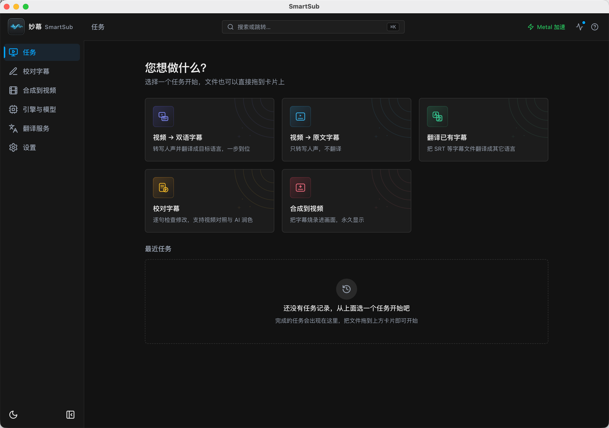
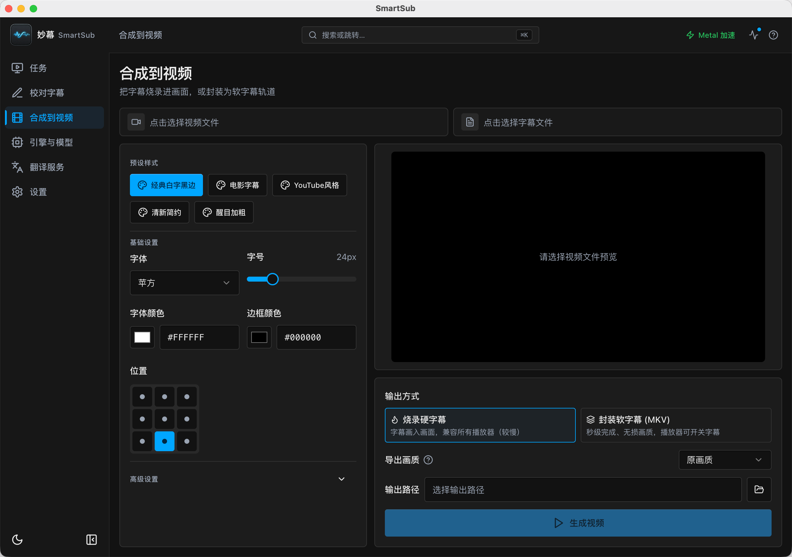
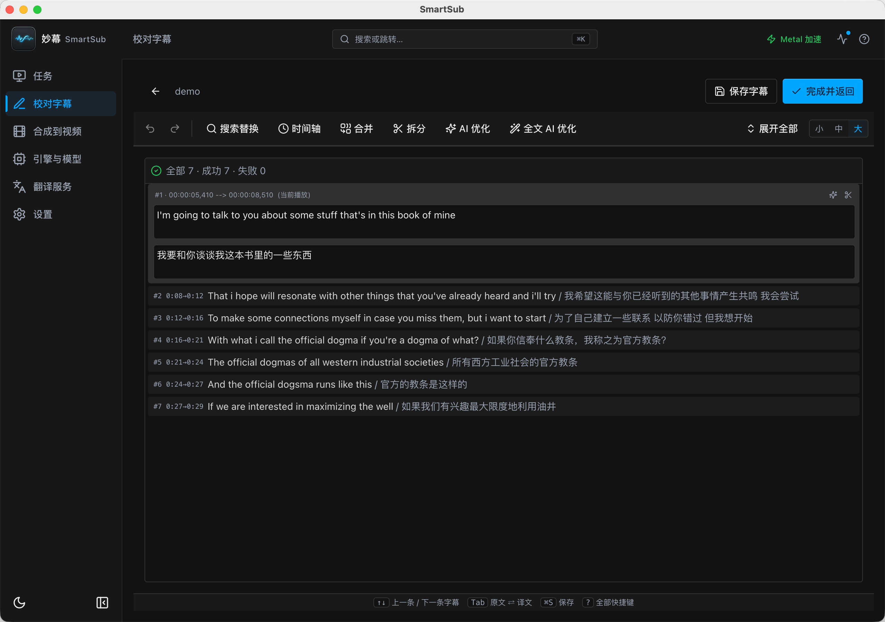

# 🚀 妙幕 / SmartSub

<div align="center">

<!-- 第1行：コアステータス - CI/バージョン/ライセンス/プラットフォーム -->

[](https://github.com/buxuku/SmartSub/actions/workflows/release.yml)
[](https://github.com/buxuku/SmartSub/releases/latest)
[](https://github.com/buxuku/SmartSub/blob/master/LICENSE)
[](https://github.com/buxuku/SmartSub/releases)
[](https://github.com/buxuku/SmartSub)

<!-- 第2行：機能 - エンジン/翻訳サービス/ハードウェアアクセラレーション -->

[](https://github.com/buxuku/SmartSub#-音声認識エンジン)
[](https://github.com/buxuku/SmartSub#翻訳サービス)
[](https://developer.nvidia.com/cuda-downloads)
[](https://www.vulkan.org/)
[](https://developer.apple.com/documentation/coreml)

<!-- 第3行：技術スタック -->

[](https://www.electronjs.org/)
[](https://nextjs.org/)
[](https://www.typescriptlang.org/)
[](https://react.dev/)
[](https://tailwindcss.com/)

<!-- 第4行：コミュニティ指標 -->

[](https://github.com/buxuku/SmartSub/releases)
[](https://github.com/buxuku/SmartSub/stargazers)
[](https://github.com/buxuku/SmartSub/network/members)
[](https://github.com/buxuku/SmartSub/issues)
[](https://github.com/buxuku/SmartSub/commits)

<br/>

[ 🇨🇳 中文](README.md) | [ 🌏 English](README_EN.md) | [ 🇯🇵 日本語](README_JA.md)

</div>

**すべてのフレームを美しく表現する**

妙幕（SmartSub）はローカルファースト設計のデスクトップアプリで、**音声・動画 → 字幕生成 → 翻訳 → 校正 → 焼き込み** までをワンストップで完結できます。文字起こしはすべてローカルで処理され、ファイルを外部にアップロードする必要はありません。バッチ処理と GPU アクセラレーションに対応し、Windows / macOS / Linux で動作します。



## ✨ 3.0 の新機能

3.0 はほぼ全面的な作り直しとなるメジャーアップデートです。主な変更点は次のとおりです：

- **🧠 複数の音声認識エンジン**：単一の whisper.cpp から、**タスクごとに切り替え可能な 6 つのエンジン**へ拡張——内蔵 `whisper.cpp`、`faster-whisper`、`FunASR`、`Qwen3-ASR`、`FireRedASR`、そしてローカルの `Whisper CLI`。中国語なら FunASR / FireRedASR が得意です。
- **⚡ GPU アクセラレーションの全面刷新**：新たに **Vulkan** バックエンドを追加し、Windows/Linux で **AMD / Intel GPU** のアクセラレーションに対応（従来は NVIDIA CUDA のみ）。「自動 / GPU のみ / CPU のみ」モードを新設し、GPU を自動検出してアクセラレーションパックを必要に応じてダウンロード、失敗時は CPU に自動フォールバックします。
- **🎬 動画合成（字幕焼き込み）**：字幕を映像に**焼き込む**（ハードサブ）か、切り替え可能な字幕トラックとして**ソフト多重化**（ソフトサブ）。WYSIWYG プレビューで、フォント・サイズ・色・縁取り・影・9 分割位置・プリセットスタイルを調整できます。
- **📝 字幕校正 + AI 推敲**：内蔵の校正ツールで動画と照らし合わせながら 1 行ずつ確認・修正。元に戻す/やり直しと、ワンクリックの AI 推敲に対応。
- **🌐 17 の翻訳サービス**：主要な機械翻訳と大規模言語モデル API に対応し、OpenAI スタイルの任意のエンドポイントやサービスごとのカスタムパラメータも利用できます。
- **🖥️ 刷新されたタスク指向 UI**：「何をしますか？」から始まるランチパッドを起点に、タスク・字幕校正・動画合成・エンジンとモデル・翻訳サービスを明快に区分。初回ガイド、コマンドパレット（⌘K / Ctrl+K）、ショートカット、ダウンロード/タスクのアクティビティセンターも備えます。

## 💥 特徴

### 🧠 字幕生成（文字起こし）

- 様々な動画/音声フォーマットの字幕を一括生成
- **6 つの文字起こしエンジン**をタスクごとに選択可能（[音声認識エンジン](#-音声認識エンジン)を参照）
- 完全ローカル処理——アップロード不要でプライバシーを守りつつ高速
- 簡体字/繁体字変換、カスタム字幕ファイル名（各種プレーヤーとの互換性向上）
- 焼き込みをより見やすくする**中国語字幕の句読点除去**（任意）
- 同時実行タスク数のカスタマイズで効率的なバッチ処理

### 🌐 字幕翻訳

- 生成した字幕、またはインポートした字幕を翻訳
- **17 の翻訳サービス**：百度、Google、阿里云、火山エンジン、豆包、小牛、騰訊、讯飞、DeepLX、Azure、Ollama（ローカル）、DeepSeek、Azure OpenAI、[DeerAPI](https://api.deerapi.com/register?aff=QvHM)、Gemini、SiliconFlow、通義千問（Qwen）
- 任意の **OpenAI スタイル API** に対応（deepseek / azure など）
- 翻訳のみ、または「原文 + 訳文」のバイリンガル字幕を選択可能
- **🎯 カスタムパラメータ設定**：コードを変更せず、UI から各 AI サービスのリクエストヘッダー/ボディを設定。エクスポート/インポートにも対応

### 📝 字幕校正

- 内蔵エディタで 1 行ずつ確認・修正
- 動画を並べて表示し、位置合わせも正確に
- 元に戻す/やり直しと**ワンクリック AI 推敲**

### 🎬 動画合成

- **ハードサブ**：字幕を映像に恒久的に焼き込み、どのプレーヤーでも表示
- **ソフトサブ**：ストリームコピーで切り替え可能な字幕トラックを無劣化で埋め込み
- 豊富なスタイル設定：フォント・サイズ・色・縁取り・影・9 分割位置・プリセット
- リアルタイムの WYSIWYG プレビュー

### ⚡ プライバシーとアクセラレーション

- ローカル処理——ファイルは端末の外に出ません
- GPU アクセラレーション：NVIDIA CUDA、AMD/Intel Vulkan、Apple Core ML / Metal（[GPU アクセラレーション](#-gpu-アクセラレーション)を参照）
- アクセラレーションパック管理を内蔵——CUDA Toolkit の手動インストール不要

## 📸 スクリーンショット

| 動画合成（字幕焼き込み）                | 字幕校正                                       |
| --------------------------------------- | ---------------------------------------------- |
|  |  |

## 🧩 音声認識エンジン

3.0 では文字起こしエンジンをタスクごとに選べるようになりました。ランタイムとモデルは「エンジンとモデル」ページでまとめて管理できます：

| エンジン                 | 説明                                                                        | 動作方式                                               |
| ------------------------ | --------------------------------------------------------------------------- | ------------------------------------------------------ |
| **whisper.cpp（内蔵）**  | デフォルトエンジン。ggml 量子化モデルと GPU アクセラレーションに対応        | アプリ内蔵、すぐに利用可能                             |
| **faster-whisper**       | CTranslate2 ベースで高速。モデルは HuggingFace から必要に応じてダウンロード | 自己完結型 Python ランタイム（アプリ内でダウンロード） |
| **FunASR**               | SenseVoice（中/英/日/韓/粤）と Paraformer-zh。中国語に強い                  | 内蔵 sherpa-onnx ネイティブライブラリ                  |
| **Qwen3-ASR**            | 通義千問の音声認識（qwen3-asr-0.6b）                                        | 内蔵 sherpa-onnx ネイティブライブラリ                  |
| **FireRedASR**           | FireRedASR-AED large（中英）。中国語に強い                                  | 内蔵 sherpa-onnx ネイティブライブラリ                  |
| **ローカル Whisper CLI** | 自分でインストールした whisper 互換コマンドを呼び出し                       | システムにインストール済みのコマンドを使用             |

> 補足：FunASR / Qwen3-ASR / FireRedASR は内蔵の sherpa-onnx ネイティブライブラリで動作し、追加環境は不要です。faster-whisper はアプリ内で自己完結型ランタイムをダウンロードします。

### whisper モデルの選び方

whisper.cpp / faster-whisper は whisper 系のモデルを使用します。モデルが大きいほど高精度ですが、低速で VRAM を多く消費します：

- ローエンド端末や内蔵 GPU：`tiny` / `base` がおすすめ。高速・軽量
- 一般的な PC：`small` / `base` から始めて精度とリソースのバランスを取る
- 高性能 GPU/ワークステーション：`large` シリーズで最高精度
- 英語のみの音声/動画：英語最適化の `en` 付きモデルを選択
- サイズが気になる場合：`q5` / `q8` の量子化版でわずかな精度低下と引き換えに軽量化

## ⚡ GPU アクセラレーション

本アプリはアクセラレーションパック管理を内蔵しており、**CUDA Toolkit を手動でインストールする必要はありません**。インストール後、「設定 → GPU アクセラレーション」を開くと、アプリが GPU を検出して適切な方式を推奨します。

| プラットフォーム              | バックエンド        | 説明                                                                              |
| ----------------------------- | ------------------- | --------------------------------------------------------------------------------- |
| Windows / Linux + NVIDIA      | **CUDA**            | CUDA 11.8.0 / 12.2.0 / 12.4.0 / 13.0.2 に対応。対応パックをアプリ内でダウンロード |
| Windows / Linux + AMD / Intel | **Vulkan**          | 3.0 新機能。アプリに内蔵の Vulkan パックを有効化                                  |
| macOS（Apple シリコン）       | **Core ML / Metal** | mac arm64 版で自動的に有効                                                        |
| すべてのプラットフォーム      | **CPU**             | 利用可能な GPU がない場合は自動フォールバック                                     |

- アクセラレーションモードは「**自動 / GPU のみ / CPU のみ**」に対応。読み込みに失敗すると自動的に CPU へ降格し、診断パネルに理由を表示します
- アクセラレーション有効後にクラッシュする場合は、別バージョンのパックに切り替えるか、「CPU のみ」モードに変更してください

## 翻訳サービス

本プロジェクトは、百度、火山エンジン、阿里云、騰訊、讯飞、小牛、Google、DeepLX に加え、Ollama、DeepSeek、Gemini、通義千問（Qwen）、SiliconFlow、Azure OpenAI、[DeerAPI](https://api.deerapi.com/register?aff=QvHM) などの大規模言語モデル/統合プラットフォームを含む、合計 17 の翻訳サービスをサポートしています。これらのサービスを使用するには、適切な API キーまたは設定が必要です。

百度翻訳や火山エンジンなどのサービスの API キー取得方法については、https://bobtranslate.com/service/ を参照してください。優れたソフトウェアツールである [Bob](https://bobtranslate.com/) が提供する情報に感謝します。

AI 翻訳では、翻訳結果はモデルとプロンプトに大きく影響されるため、様々な組み合わせを試して自分に合うものを見つけてください。AI 統合プラットフォーム [DeerAPI](https://api.deerapi.com/register?aff=QvHM) をお勧めします。複数のプラットフォームで約 500 種類のモデルをサポートしています。

### カスタムパラメータ設定

SmartSub は各 AI 翻訳サービスのカスタムパラメータ設定をサポートし、モデルの動作を精密に制御できます：

- **柔軟な設定**：コードを変更せず、UI から直接パラメータを追加・管理
- **型サポート**：String、Float、Boolean、Array、Object、Integer
- **リアルタイム検証**：編集時に検証し、無効な設定を防止
- **インポート/エクスポート**：チーム共有やバックアップが容易
- **自動保存**：アプリの設計に沿って、すべての変更を自動保存

## 🔦 使用方法（エンドユーザー向け）

お使いのシステムとチップに合ったパッケージをダウンロードしてください。GPU アクセラレーションパックはダウンロード時に選ぶ必要はなく、インストール後にアプリ内で取得できます。

| システム | チップ | ダウンロードパッケージ | 説明                                                         |
| -------- | ------ | ---------------------- | ------------------------------------------------------------ |
| Windows  | x64    | windows-x64            | NVIDIA は CUDA、AMD/Intel は Vulkan をアプリ内でダウンロード |
| Mac      | Apple  | mac-arm64              | Core ML / Metal アクセラレーション自動有効                   |
| Mac      | Intel  | mac-x64                | CPU のみ、GPU アクセラレーション非対応                       |
| Linux    | x64    | linux-x64              | NVIDIA は CUDA、AMD/Intel は Vulkan をアプリ内でダウンロード |

### Homebrew でインストール（macOS）（推奨）

macOS ユーザーは Homebrew で素早くインストールでき、チップタイプ（Intel/Apple Silicon）に基づいて正しいバージョンが自動的にダウンロードされます：

```bash
# tap を追加（一度だけ必要）
brew tap buxuku/tap

# インストール
brew install --cask smartsub
```

アップグレードとアンインストール：

```bash
# 最新バージョンにアップグレード
brew upgrade --cask smartsub

# アンインストール
brew uninstall --cask smartsub
```

### 手動ダウンロード

1. [リリース](https://github.com/buxuku/SmartSub/releases)ページに移動し、お使いの OS 用の適切なパッケージをダウンロードします
2. または、クラウドディスク [Quark](https://pan.quark.cn/s/0b16479b40ca) を使用して対応するバージョンをダウンロードします
3. プログラムをインストールして実行します
4. 初回ガイドに従って音声モデルをダウンロードします
5. 「翻訳サービス」で必要な翻訳サービスを設定します（任意）
6. ランチパッドからタスクを選び、音声/動画または字幕ファイルをドラッグします
7. 関連パラメータ（ソース言語、ターゲット言語、エンジン、モデルなど）を設定します
8. 処理タスクを開始します

## 🔦 使用方法（開発者向け）

1️⃣ プロジェクトをローカルにクローン

```shell
git clone https://github.com/buxuku/SmartSub.git
```

2️⃣ `yarn install` または `npm install` で依存関係をインストール

```shell
cd SmartSub
yarn install
yarn sherpa:fetch # sherpa-onnx 原生ライブラリをダウンロード
```

Windows / Linux、または Mac Intel プラットフォームの場合は、https://github.com/buxuku/whisper.cpp/releases/tag/latest から node ファイルをダウンロードし、`addon.node` にリネームして `extraResources/addons/` ディレクトリに配置してください。

3️⃣ 依存関係をインストール後、`yarn dev` または `npm run dev` を実行してプロジェクトを起動

```shell
yarn dev
```

## モデルの手動ダウンロードとインポート

モデルファイルのサイズが大きいため、ソフトウェア経由でのダウンロードが困難な場合があります。モデルを手動でダウンロードしてアプリケーションにインポートできます。whisper モデルをダウンロードするための 2 つのリンクがあります：

1. 国内ミラー（ダウンロード速度が速い）：
   https://hf-mirror.com/ggerganov/whisper.cpp/tree/main

2. Hugging Face 公式ソース：
   https://huggingface.co/ggerganov/whisper.cpp/tree/main

Apple シリコンの場合は、対応する encoder.mlmodelc ファイルもダウンロードし、解凍してモデルと同じディレクトリに配置する必要があります。（q5 または q8 シリーズのモデルでは不要です）

ダウンロード後、「エンジンとモデル」ページの「モデルをインポート」機能でモデルファイルをインポートするか、モデルディレクトリに直接コピーできます。

インポート手順：

1. 「エンジンとモデル」ページで「モデルをインポート」ボタンをクリックします。
2. 表示されるファイルセレクタで、ダウンロードしたモデルファイルを選択します。
3. インポートを確認すると、モデルがインストール済みモデルリストに追加されます。

> FunASR / Qwen3-ASR / FireRedASR などのエンジンのモデルは、「エンジンとモデル」ページ内で必要に応じてダウンロードできます（ModelScope / GitHub など複数のソースに対応）。

## よくある問題

##### 1. 「アプリケーションが破損しているため開けません」というメッセージ

ターミナルで以下のコマンドを実行してください：

```shell
sudo xattr -dr com.apple.quarantine /Applications/SmartSub.app
```

その後、アプリケーションを再度実行してみてください。

## 貢献

👏🏻 このプロジェクトの改善にご協力いただける Issue や Pull Request を歓迎します！

## サポート

⭐ このプロジェクトが役立つと思ったら、スターを付けていただくか、コーヒーをおごってください（GitHub アカウントを備考欄にご記入ください）。

👨‍👨‍👦‍👦 使用上の問題がある場合は、WeChat コミュニティグループに参加して一緒に交流・学習しましょう。

| Alipay 寄付コード                              | WeChat 寄付コード                            | WeChat コミュニティグループ                 |
| ---------------------------------------------- | -------------------------------------------- | ------------------------------------------- |
|  |  |  |

## ライセンス

このプロジェクトは MIT ライセンスの下でライセンスされています。詳細については [LICENSE](LICENSE) ファイルを参照してください。

## Star History

[](https://star-history.com/#buxuku/SmartSub&Date)
