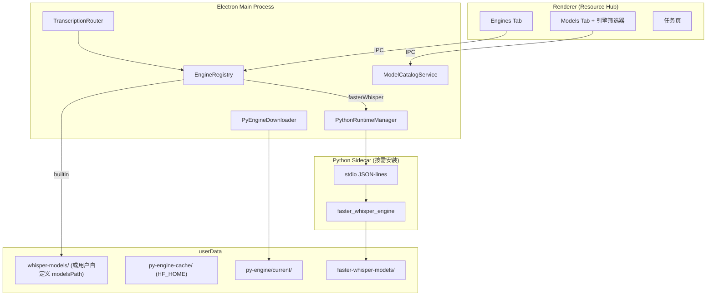
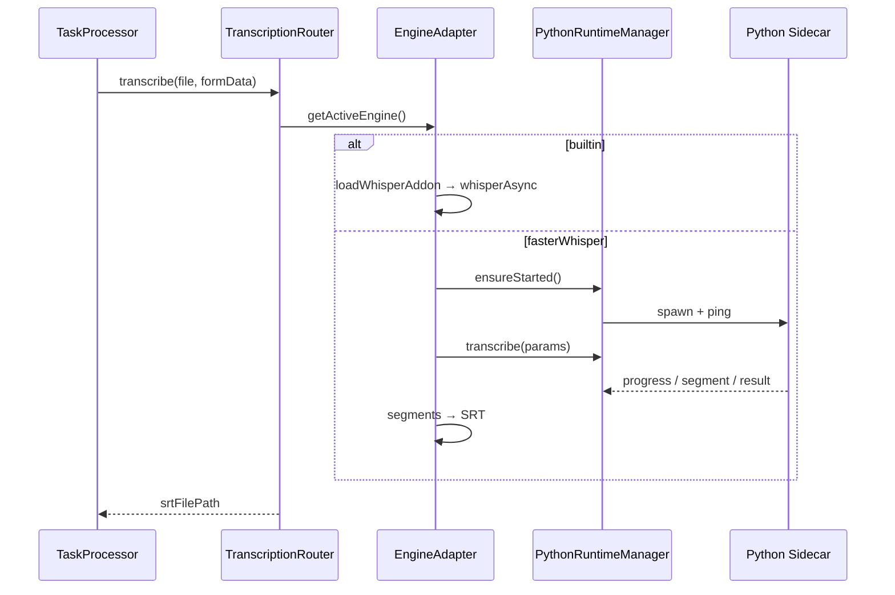

# 多转写引擎架构设计（whisper.cpp + faster-whisper）

> 状态：已评审  
> 日期：2026-06-13  
> 范围：转写引擎抽象层 · Python 运行时基座 · faster-whisper 按需分发 · 资源中心 Engines Tab · 按引擎区分模型管理  
> 开发基线：从 `feat/resource-hub` 拉新分支；参考 `feat/python-engine-poc` 思路，**全新实现**（不直接 merge POC 代码）  
> 关联：`main/helpers/addonDownloader.ts`、`whisper.cpp/.github/workflows/builder.yml`、`renderer/components/resources/`

---

## 1. 背景与目标

### 1.1 现状

SmartSub 当前默认使用内置 **whisper.cpp**（N-API addon + ggml 模型）。`feat/python-engine-poc` 分支已验证：

- Python sidecar（stdio JSON-lines 协议）+ `PythonEngineManager`
- faster-whisper 真实转写链路
- PyInstaller onedir 冻结打包 + 独立 CI（`python-engine.yml`）

但 POC 未完成产品化：引擎选择在 `settings.tsx`、安装包可选内置 Python 引擎、模型页未按引擎区分、无完整按需下载器。

`feat/resource-hub` 已完成资源中心 UI 骨架（Overview / Models / Providers / Acceleration），尚未有引擎管理模块。

### 1.2 目标

1. 在保留 whisper.cpp 为默认引擎的前提下，新增 **faster-whisper** 作为可选引擎。
2. faster-whisper **纯按需下载**（安装包零增量），分发模式对齐 CUDA addon。
3. 资源中心新增 **Engines Tab**，用户可查看状态、下载、切换引擎。
4. Models Tab 增加 **引擎筛选器**，按引擎展示不同格式的模型目录。
5. **向前兼容**老用户已下载的 ggml 模型及自定义 `modelsPath`，零迁移。
6. Python 运行时作为 **可扩展基座**（v1 聚焦转写，协议与目录预留未来 Python 能力）。

### 1.3 用户确认的关键决策

| 决策点              | 选择                                               |
| ------------------- | -------------------------------------------------- |
| faster-whisper 分发 | 纯按需下载（类似 CUDA addon）                      |
| 资源中心 UI         | 新增「引擎」Tab，与 Models / Acceleration 平级     |
| 模型管理            | Models Tab 顶部引擎筛选器                          |
| faster-whisper GPU  | 单平台包 + `device=auto` 运行时检测                |
| Python 基座 v1 范围 | 转写优先，接口预留                                 |
| 开发方式            | 从 `feat/resource-hub` 拉新分支，参考 POC 全新实现 |
| 老用户模型目录      | **modelsPath / ggml 零迁移、语义不变**             |

### 1.4 非目标（v1 不做）

- 不 bundle Python 引擎进安装包。
- 不拆 faster-whisper CUDA 变体 CI 矩阵（v1 单包含 CPU ctranslate2）。
- 不实现 sherpa-onnx / SenseVoice 等第四引擎（仅预留 `EngineRegistry` 扩展点）。
- 不迁移或合并 ggml 与 CT2 模型到同一目录。
- 不做通用 Python 插件市场。

---

## 2. 总体架构



### 2.1 核心原则

1. **引擎可插拔** — 每个引擎实现 `TranscriptionEngineAdapter`，由 `EngineRegistry` 注册。
2. **Python 是运行时基座，不是业务层** — `PythonRuntimeManager` 与引擎适配器分离。
3. **默认零增量** — 安装包不含 Python 引擎；whisper.cpp 仍内置。
4. **Sidecar 隔离** — Python 崩溃/GIL 不拖垮 Electron 主进程。
5. **参考 POC、全新实现** — 协议格式沿用，代码在 `feat/resource-hub` 新分支上重写。

### 2.2 推荐方案（相对 B/C 的取舍）

| 方案                                | 结论                                     |
| ----------------------------------- | ---------------------------------------- |
| A. Sidecar + PyInstaller + 按需下载 | **采用** — 与 addon 分发同构，跨平台可控 |
| B. 嵌入式 Python + pip 首次安装     | 否决 — 跨平台依赖地狱                    |
| C. 依赖用户系统 Python              | 否决 — 与产品定位冲突                    |

---

## 3. 模块设计

### 3.1 目录结构（新增/改造）

```
main/helpers/
  pythonRuntime/
    manager.ts          # sidecar 生命周期
    protocol.ts         # JSON-lines 类型
    index.ts            # 命令解析 + 单例
    downloader.ts       # 按需下载
  engines/
    registry.ts         # EngineRegistry
    types.ts            # TranscriptionEngineAdapter 接口
    builtinEngine.ts    # whisper.cpp 包装
    fasterWhisperEngine.ts
  transcriptionRouter.ts
  modelCatalog.ts       # 双轨模型目录服务

python-engine/          # CI 构建用，不随主应用打包
  main.py
  engines/
    __init__.py
    faster_whisper_engine.py
  smartsub-engine.spec
  requirements.txt
  smoke_test.py

renderer/components/resources/
  EnginesTab.tsx        # 新增
  ModelsTab.tsx         # 改造：引擎筛选器

.github/workflows/
  python-engine.yml     # 新增/参考 POC
```

### 3.2 `TranscriptionEngineAdapter` 接口

```typescript
type TranscriptionEngine = 'builtin' | 'fasterWhisper' | 'localCli';

interface EngineStatus {
  state: 'ready' | 'not_installed' | 'downloading' | 'error';
  version?: string;
  message?: string;
}

interface TranscriptionEngineAdapter {
  id: TranscriptionEngine;
  displayName: string;
  requiresRuntime: boolean;
  isAvailable(): Promise<EngineStatus>;
  transcribe(ctx: TranscribeContext): Promise<string>; // 返回 srt 路径
  cancel(requestId: string): void;
  getSupportedModels(): ModelCatalogEntry[];
}
```

`fileProcessor.ts` / `subtitleGenerator.ts` 通过 `TranscriptionRouter` 调用，不再硬编码 `generateSubtitleWithBuiltinWhisper`。

### 3.3 `PythonRuntimeManager`

| 职责     | 说明                                                                               |
| -------- | ---------------------------------------------------------------------------------- |
| 安装检测 | `userData/py-engine/current/smartsub-engine[.exe]` 存在且可执行                    |
| 版本管理 | `userData/py-engine/manifest.json`（version、platform、sha256、installedAt）       |
| 生命周期 | `ensureStarted()` → spawn → ping；app quit → `shutdown`                            |
| 环境隔离 | 清除 `PYTHONPATH`、`PYTHONHOME`、`VIRTUAL_ENV`、`CONDA_*`；设 `PYTHONNOUSERSITE=1` |
| HF 缓存  | `HF_HOME` → `userData/py-engine-cache`                                             |
| 崩溃恢复 | `exit` → reject 全部 pending → 下次惰性重启                                        |
| 协议     | id → pending promise；`progress`/`segment` 事件回调                                |

### 3.4 Sidecar 协议（JSON-lines）

```
# 请求（期待应答）
{ "id": "req-1", "method": "ping"|"transcribe", "params": {...} }

# 通知（无 id）
{ "method": "cancel", "params": { "id": "req-1" } }
{ "method": "shutdown", "params": {} }

# 响应
{ "id": "req-1", "result": {...} }
{ "id": "req-1", "error": { "code": "...", "message": "..." } }

# 事件
{ "method": "progress", "params": { "id": "req-1", "percent": 42.5 } }
{ "method": "segment", "params": { "id": "req-1", "start": 0, "end": 1.2, "text": "..." } }
```

约束：Python 侧 **stdout 仅输出协议消息**；所有日志走 stderr。

---

## 4. 分发、下载与 CI

### 4.1 Release 资产

GitHub Release tag：`py-engine-v{version}`

```
smartsub-engine-macos-arm64.tar.gz
smartsub-engine-macos-x64.tar.gz
smartsub-engine-windows-x64.tar.gz
smartsub-engine-linux-x64.tar.gz
checksums.sha256
```

主应用 `electron-builder.yml` **不包含** `extraResources/py-engine/`。

### 4.2 本地安装布局

```
userData/
  py-engine/
    manifest.json
    current/                 # onedir 解压目标（原子替换）
      smartsub-engine[.exe]
      _internal/...
    staging/                 # 解压临时目录
    downloads/               # 断点续传临时文件
  py-engine-cache/           # HF_HOME
```

### 4.3 `PyEngineDownloader`（仿 `AddonDownloader`）

| 能力     | 实现                                            |
| -------- | ----------------------------------------------- |
| 下载源   | GitHub + ghproxy（与 addon 一致）               |
| 断点续传 | HTTP Range + `py-engine-download-state.json`    |
| 校验     | SHA256 对比 release `checksums.sha256`          |
| 安装     | 解压到 `staging/` → 校验 → rename 为 `current/` |
| 进度     | IPC `py-engine-download-progress`               |
| 平台映射 | 复用 `getEffectivePlatform()` + arch            |

### 4.4 CI 矩阵（`.github/workflows/python-engine.yml`）

| Runner         | 产物 suffix | 备注                                      |
| -------------- | ----------- | ----------------------------------------- |
| macos-latest   | macos-arm64 | `MACOSX_DEPLOYMENT_TARGET=12.0`，codesign |
| macos-15-intel | macos-x64   | 同上                                      |
| windows-2022   | windows-x64 | PyInstaller onedir，console=True          |
| ubuntu-22.04   | linux-x64   | glibc 兼容                                |

流程：Python 3.11 → pip install → PyInstaller → `smoke_test.py` → tar.gz → 发布。

**v1 GPU**：单包含 CPU 版 ctranslate2；`device=auto` 在运行时尝试 CUDA，失败降级 CPU。

### 4.5 版本升级

- 可选启动检查：本地 `manifest.version` vs release latest
- Engines Tab 显示「有新版本」
- 升级 = 重新下载 + 原子替换，不影响 `py-engine-cache` 内已下载模型

---

## 5. 模型管理（含老用户兼容）

### 5.1 兼容原则（硬性约束）

| 规则                           | 说明                                                      |
| ------------------------------ | --------------------------------------------------------- |
| `settings.modelsPath` 语义不变 | **仅**指 whisper.cpp ggml 模型目录                        |
| 默认路径不变                   | `userData/whisper-models/`                                |
| 文件命名不变                   | `ggml-{model}.bin` + 可选 `ggml-{model}-encoder.mlmodelc` |
| `getModelsInstalled()` 不变    | 扫描 `modelsPath` 下 `ggml-*.bin`                         |
| 下载/导入/删除不变             | `ModelDownloader`、`deleteModel`、`importModel` 行为保持  |
| 自定义路径尊重                 | 用户改过 `modelsPath` 的，ggml 仍在原位置，直接可用       |

**禁止**：搬迁已有 ggml 文件；将 ggml 与 CT2 混放；改变 Settings 中「模型路径」的含义。

### 5.2 faster-whisper 模型目录（新增，独立）

```typescript
settings.fasterWhisperModelsPath;
// 默认: userData/faster-whisper-models/
// 存储: HuggingFace CT2 模型（如 models--Systran--faster-whisper-small/）
```

模型由 faster-whisper / HuggingFace Hub 按需下载；缓存同时写入 `HF_HOME`（`py-engine-cache`）。

### 5.3 Models Tab 引擎筛选器

顶部 Segmented Control：`[ whisper.cpp ]` `[ faster-whisper ]`

| 筛选项         | 数据源                                                              | 路径                               |
| -------------- | ------------------------------------------------------------------- | ---------------------------------- |
| whisper.cpp    | 现有 `models.json` + `getModelsInstalled()`                         | `settings.modelsPath`              |
| faster-whisper | 新 `fasterWhisperModels.json` + `getFasterWhisperModelsInstalled()` | `settings.fasterWhisperModelsPath` |

切换筛选器只改变 UI 与下载目标，**不修改任何已有目录**。

### 5.4 模型名映射（跨引擎任务参数）

ggml 量化后缀为 whisper.cpp 特有；faster-whisper 由 `compute_type` 控制精度：

```
ggml-small-q5_0   →  faster-whisper id: "small"
ggml-large-v3-turbo → "large-v3-turbo"（维护显式映射表）
```

任务层按当前 `transcriptionEngine` 做映射；ggml 文件名本身不变。

### 5.5 `getSystemInfo` 扩展

```typescript
{
  modelsInstalled: string[];              // 不变：ggml
  fasterWhisperModelsInstalled: string[]; // 新增
  modelsPath: string;                     // 不变
  fasterWhisperModelsPath: string;        // 新增
  transcriptionEngine: TranscriptionEngine;
  pythonEngineStatus: EngineStatus;
}
```

### 5.6 任务页模型下拉

- `builtin` → 仅列 `modelsInstalled`
- `fasterWhisper` → 仅列 `fasterWhisperModelsInstalled`；空列表时引导至 Models Tab

---

## 6. 资源中心 UI

### 6.1 Tab 结构

```
资源中心
  ├── 概览      — 新增「当前引擎」卡片入口
  ├── 引擎      — 新增（本节主体）
  ├── 模型      — 引擎筛选器
  ├── 翻译服务
  └── 加速      — 仅 whisper.cpp GPU（CUDA/Vulkan/Metal），不含引擎切换
```

### 6.2 Engines Tab

每张引擎卡片：

| 引擎                | 状态                 | 操作                              |
| ------------------- | -------------------- | --------------------------------- |
| whisper.cpp（内置） | 已就绪               | 设为当前                          |
| faster-whisper      | 未安装 / 已安装 vX.Y | 下载 / 设为当前 / 卸载 / 检查更新 |
| 本地命令行          | 需配置               | 设为当前 + 跳转命令配置           |

faster-whisper 展开区：`device`（auto/cpu/cuda）、`compute_type`（auto/int8/float16…）。

**切换流程**：

1. 用户选择 faster-whisper → 检测 `PyEngineDownloader` 安装状态
2. 未安装 → 确认弹窗（约 170MB）→ 下载 → 完成后切换 `transcriptionEngine`
3. 有 running task 时禁止切换（或提示等待完成）

### 6.3 i18n

新增 `resources` 命名空间键：`tab.engines`、`engine.*`、`fasterWhisper.*`；中英文同步。

---

## 7. 转写链路



**取消**：

- builtin：现有 `whisperAsync.abort()`
- fasterWhisper：`PythonRuntimeManager.cancel(id)` → sidecar `cancel` 通知

**进度**：sidecar `progress.percent` → 现有 `taskProgressChange` IPC。

---

## 8. 设置与迁移

### 8.1 Store 新增字段

```typescript
settings: {
  transcriptionEngine?: 'builtin' | 'fasterWhisper' | 'localCli'; // 默认 builtin
  fasterWhisperDevice?: 'auto' | 'cpu' | 'cuda';
  fasterWhisperComputeType?: string; // 默认 'auto'
  fasterWhisperModelsPath?: string;  // 默认 userData/faster-whisper-models
  // modelsPath 不变
  // useLocalWhisper 保留，由 transcriptionEngine === 'localCli' 推导
}
```

### 8.2 升级迁移

```typescript
function resolveTranscriptionEngine(settings) {
  if (settings.transcriptionEngine) return settings.transcriptionEngine;
  return settings.useLocalWhisper ? 'localCli' : 'builtin';
}
```

老用户无 `transcriptionEngine` 字段时行为与现网一致（builtin 或 localCli）。

---

## 9. 风险与规避

| 风险                           | 规避                                      |
| ------------------------------ | ----------------------------------------- |
| 系统 Python/conda 穿透         | `buildSanitizedEnv()`                     |
| sidecar 崩溃                   | exit handler reject pending；任务层 catch |
| PyInstaller 体积大             | 明确显示下载大小；镜像源；断点续传        |
| macOS Gatekeeper               | CI codesign + notarize                    |
| Windows Defender 误报          | 代码签名；禁用 UPX                        |
| stdout 污染破坏协议            | Python logging 仅 stderr                  |
| ggml 误用于 faster-whisper     | 引擎筛选 + 任务页按引擎过滤模型           |
| 老用户自定义 modelsPath 被破坏 | **modelsPath 语义与扫描逻辑不变**         |
| ctranslate2 CUDA 不可用        | device=auto 降级 CPU；UI 显示实际 device  |
| HF 下载慢                      | hf-mirror；`HF_HOME` 本地化               |
| 引擎切换中有任务运行           | 禁止切换或等待完成                        |
| 未来引擎膨胀                   | `EngineRegistry` 注册模式                 |

---

## 10. 测试策略

| 层级      | 内容                                                            |
| --------- | --------------------------------------------------------------- |
| Python    | `smoke_test.py` 对冻结产物 ping + fake transcribe               |
| Main 单元 | `PythonRuntimeManager` 协议解析、env 消毒、cancel               |
| 集成      | DevTools `pythonEngine:ping` / `transcribeFile` IPC             |
| E2E 冒烟  | 三平台：下载引擎 → 切换 → tiny 模型转写 → 产出 SRT              |
| 回归      | 老用户 modelsPath 下已有 ggml 模型仍可被 builtin 引擎识别并使用 |

---

## 11. 实施顺序建议

1. **基础设施**：`python-engine/` 源码 + CI + `PyEngineDownloader`
2. **运行时**：`PythonRuntimeManager` + 协议 + IPC handlers
3. **引擎层**：`EngineRegistry` + `builtinEngine` + `fasterWhisperEngine` + `TranscriptionRouter`
4. **UI**：Engines Tab → Models Tab 筛选器 → Overview 联动
5. **模型**：`fasterWhisperModels.json` + 双轨检测 + 映射表
6. **打磨**：i18n、错误提示、升级检查、文档

---

## 12. 未来扩展（v1 仅预留）

- `EngineRegistry.register('senseVoice', ...)` — N-API 引擎，无需 Python
- Sidecar 新方法：`punctuate`、`diarize` 等
- faster-whisper CUDA 变体分包（对齐 addon CUDA 矩阵）
- 引擎级 benchmark / 推荐
