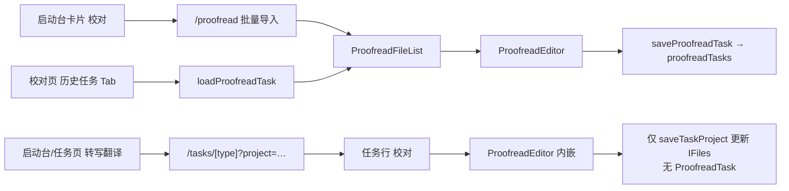

# 校对历史任务 vs 启动台最近任务 — 合并可行性分析

> 日期：2026-06-13  
> 背景：用户反馈「校对页的历史任务」与「启动台最近任务」功能重叠，希望评估是否合并。  
> 关联蓝图：`2026-06-11-ux-redesign-blueprint-design.md` §6.3 WorkItem；P5 计划曾明确 **defer 到 P6 评估**。

---

## 1. 现状：两套互不相通的数据

| 维度           | 启动台「最近任务」                                        | 校对页「历史任务」                                   |
| -------------- | --------------------------------------------------------- | ---------------------------------------------------- |
| **存储键**     | `taskProjects`                                            | `proofreadTasks`                                     |
| **主进程**     | `main/helpers/taskManager.ts`                             | `main/helpers/proofreadStore.ts`                     |
| **类型**       | `TaskProject`                                             | `ProofreadTask`                                      |
| **任务类型**   | `generateAndTranslate` / `generateOnly` / `translateOnly` | 无 taskType；批次校对                                |
| **粒度**       | 1 工程 → 多 `IFiles`（流水线文件）                        | 1 批次 → 多 `ProofreadItem`（视频+字幕对）           |
| **进度语义**   | 转写/翻译阶段（waiting/running/done/error）               | 每项 `lastPosition` / `modifiedCount` / item status  |
| **入口 UI**    | `home.tsx` 底部列表                                       | `proofread.tsx` Tab「历史任务」→ `ProofreadTaskList` |
| **点击去向**   | `/tasks/[slug]?project=id`                                | 同页内 `handleLoadTask` 恢复批次                     |
| **持久化时机** | 拖放/新建即保存；任务页自动更新 files                     | **须用户点「保存到历史」**（首次保存后自动增量）     |
| **重启恢复**   | ✅ 工程与文件列表保留                                     | ✅ 批次与每项进度保留                                |

**结论**：产品层面都是「最近在做的事」，但数据模型、进度含义、入口路由完全不同，且 **互不引用**。

---

## 2. 用户困惑来源（「任务」一词三义）

UX 重构文档与代码现状一致，存在三种「任务」：

1. **TaskProject（流水线工程）** — 转写/翻译任务页上的「N 个文件」
2. **ProofreadTask（校对批次）** — 校对模块里手动导入、批量保存的会话
3. **会话内状态** — 任务页内嵌 `ProofreadEditor` 时的 **内存态**（`setProofreadFile`），**不会**写入 `proofreadTasks`

因此用户常见预期落差：

- 在 **任务页** 里校对过 → 启动台能看到该工程，但 **校对页历史里没有**
- 在 **校对页** 保存批次 → 只在「历史任务」Tab，**启动台最近任务不出现**
- 两处都叫「任务」，却 **不能互相续接**

---

## 3. 三条进入校对的路径



| 路径                         | 是否出现在最近任务 | 是否出现在校对历史 |
| ---------------------------- | ------------------ | ------------------ |
| 批量校对 `/proofread` + 保存 | ❌                 | ✅                 |
| 任务页内嵌校对               | ✅（TaskProject）  | ❌                 |
| 仅打开校对页未保存           | ❌                 | ❌                 |

**合并讨论的核心**：用户期望的是 **一个「继续上次工作」的列表**，而不是两个各管一半的列表。

---

## 4. 数据模型差异（决定合并成本）

### TaskProject + IFiles

- 面向 **自动化流水线**：抽音频 → Whisper → 翻译 → 产物路径写在 `IFiles` 字段
- 状态由 `stageUtils` 从布尔/路径字段 **推导**
- 无「字幕检测置信度」「原文/译文字幕切换」等校对专用字段

### ProofreadTask + ProofreadItem

- 面向 **人工编辑会话**：`sourceSubtitlePath` / `targetSubtitlePath`、语言、`detectedSubtitles[]`
- 细粒度进度：`lastPosition`、`modifiedCount`、每项 `status`
- 支持 **仅字幕文件** 导入（无视频）

### 蓝图 WorkItem（§6.3 目标态）

```
WorkItem {
  id, type(双语/原文/翻译/校对/合成),
  源文件, artifacts[], status,
  各阶段进度, 配置快照, createdAt/finishedAt
}
```

- 设计意图：**取代**「内存任务列表 + 独立校对任务」两套存储
- 启动台、任务页、校对历史 **共用同一模型**
- 属于 **架构级重构**，非小改 UI 能完成

---

## 5. 合并方案对比

### 方案 A — 轻量「展示统一」（推荐作为 P6 第一步）

**做法**

- 启动台「最近任务」合并展示：`getTaskProjects` + `getProofreadTasks`，按 `updatedAt` 排序
- 校对批次卡片：类型 Badge「校对」、进度文案（如 2/5 项完成）、点击 → `/proofread` 并 `loadTask(id)`
- 校对页：移除或弱化「历史任务」Tab，改为「已在启动台最近任务中」或只保留空态跳转
- 数据层 **仍两套**，增加 `LaunchpadRecentItem` 适配器即可

**优点**

- 用户只找一个列表；改动集中在 `home.tsx` + 路由参数
- 风险低，可渐进上线
- 与蓝图方向一致，但不阻塞后续 WorkItem

**缺点**

- 删除/重命名需两套 IPC
- 任务页内嵌校对仍不进校对历史（需文案说明或方案 B 桥接）

**工作量**：约 **2–4 人日**（含 i18n、空态、深链 `?task=`）

---

### 方案 B — 桥接流水线与校对批次（中等）

**做法**

- 任务页「批量校对」或工程完成后：从 `TaskProject.files` **生成** `ProofreadTask`（或反向挂 `linkedProofreadTaskId`）
- 启动台仍可用方案 A 统一展示
- 内嵌校对退出时可选「同步到校对批次」

**优点**

- 解决「转写翻译后想接着批量校对」的主路径断裂
- 仍不必立刻上 WorkItem

**缺点**

- 需定义 **去重规则**（同一 srt 是否重复建批次）
- `IFiles` 与 `ProofreadItem` 字段映射与迁移脚本

**工作量**：约 **5–8 人日**（含映射、测试、边界：仅字幕工程）

---

### 方案 C — 真合并 WorkItem（蓝图完整落地）

**做法**

- 新类型 + 迁移：`taskProjects` + `proofreadTasks` → `workItems`
- 统一 IPC：`getWorkItems` / `saveWorkItem`
- 任务页、校对页、启动台全部读 WorkItem；`IFiles` / `ProofreadItem` 作为子结构或 artifact

**优点**

- 长期维护成本最低；术语可统一为「工作项」
- 支持蓝图中的中断恢复、产物链接、跨阶段 [校对][合成]

**缺点**

- **大范围改动**：main store、所有 IPC、任务页、校对页、 onboarding 示例工程
- 需一次性迁移与回滚策略

**工作量**：约 **15–25 人日**（单独批次，如 P19 / WorkItem Epic）

---

## 6. 与当前产品决策的对齐

| 文档                    | 说法                                                                 |
| ----------------------- | -------------------------------------------------------------------- |
| P5 实施计划             | 校对历史 **不** 并入 WorkItem，留 P6 评估                            |
| 剩余路线图 `2026-06-12` | B16 后功能向批次基本收尾；WorkItem 未排期                            |
| UX 报告                 | 「任务三义」为 P0 术语问题；Tab 在编辑态已隐藏，**列表级双入口仍在** |

**建议排期**

1. **现在（P6 轻量）**：方案 A — 启动台统一展示，校对页历史 Tab 降级
2. **下一迭代**：方案 B — 任务完成 → 可选创建校对批次
3. **大版本**：方案 C — WorkItem，与 `IFiles` 类型正型一并做

不推荐 **仅改文案** 作为终态（方案 D）：能减 confusion，但解决不了「两处找任务」。

---

## 7. 术语与 UI 建议（与合并配套）

若采用方案 A，建议同步：

| 现文案               | 建议                                                              |
| -------------------- | ----------------------------------------------------------------- |
| 启动台「最近任务」   | 「最近工作」或「继续处理」                                        |
| 校对 Tab「历史任务」 | 移除或改为「从启动台打开已保存的校对批次」                        |
| 校对「保存到历史」   | 「保存批次」/「保存到最近工作」（与启动台联动后更直观）           |
| 任务页内嵌校对       | Tooltip：「进度保存在当前工程中；批量校对请从启动台进入校对模块」 |

---

## 8. 风险与开放问题

1. **排序与上限**：两源合并后是否仍限制 20 条？校对批次与工程是否同一配额？
2. **删除语义**：启动台删除校对批次 = 删 `proofreadTasks` 条目，需确认对话框文案
3. **深链**：`/proofread?task=uuid` 与 `/tasks/...?project=uuid` 并存，需统一「返回」行为
4. **未保存批次**：方案 A 不应把未保存的 `pendingFiles` 暴露到启动台（仅 `proofreadTasks`）
5. **内嵌校对**：是否纳入统一列表 = 方案 B 范畴；仅 A 时需在 UI 上写清边界

---

## 9. 推荐结论

| 优先级   | 行动                                                                                  |
| -------- | ------------------------------------------------------------------------------------- |
| **推荐** | **方案 A**：启动台合并展示 + 校对页去掉重复历史 Tab；成本低、立刻消除「两个最近列表」 |
| **随后** | **方案 B**：TaskProject → ProofreadTask 桥接，打通主工作流                            |
| **长期** | **方案 C**：WorkItem，按蓝图 §6.3 单独 Epic                                           |

**不建议** 在不做展示统一的情况下，仅合并 Tab 或改名称——用户仍会在两个页面找「上次校对到哪了」。

---

## 10. 附录：相关文件索引

| 用途                  | 路径                                                                     |
| --------------------- | ------------------------------------------------------------------------ |
| 启动台最近任务        | `renderer/pages/[locale]/home.tsx`                                       |
| 校对页 Tab / 加载历史 | `renderer/pages/[locale]/proofread.tsx`                                  |
| 校对历史列表 UI       | `renderer/components/proofread/ProofreadTaskList.tsx`                    |
| TaskProject IPC       | `main/helpers/taskManager.ts`                                            |
| ProofreadTask IPC     | `main/helpers/proofreadStore.ts`                                         |
| 类型                  | `types/types.ts`, `types/proofread.ts`                                   |
| 任务页内嵌校对        | `renderer/pages/[locale]/tasks/[type].tsx`                               |
| 蓝图 WorkItem         | `docs/superpowers/specs/2026-06-11-ux-redesign-blueprint-design.md` §6.3 |

---

## 11. 决策记录

**2026-06-13 用户确认：采用方案 C（WorkItem 真合并）**

理由：方便维护与后续扩展。

实施计划见：`docs/superpowers/plans/2026-06-13-workitem-unification-plan.md`

---

## 12. 原「待确认」选项（已关闭）

- ~~**A** — 先做启动台统一展示~~
- ~~**B** — 再加 TaskProject ↔ ProofreadTask 桥接~~
- **C** — 直接立项 WorkItem 大合并 ✅ **已选**
- ~~**暂缓** — 保持双列表~~
