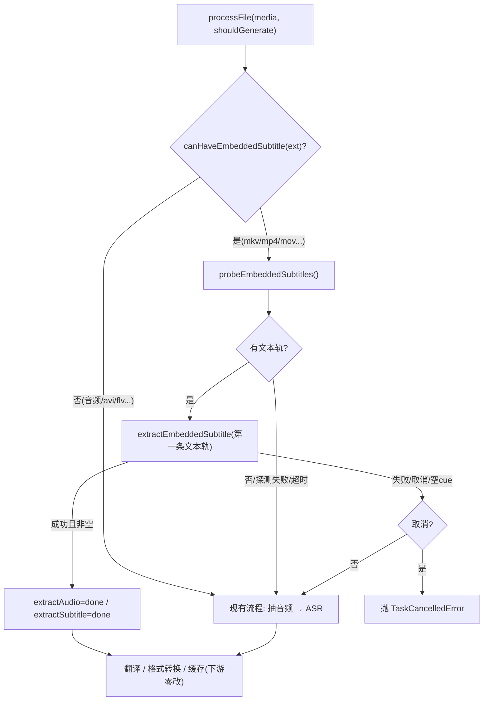

# 内嵌软字幕直提设计（Embedded Subtitle Extraction）

> 状态：已评审
> 日期：2026-06-15
> 范围：视频转字幕管线 · 内封文本字幕探测与抽取 · 复用现有任务节点
> 关联：`main/helpers/fileProcessor.ts`、`main/helpers/audioProcessor.ts`、`renderer/components/tasks/stageUtils.ts`

---

## 1. 背景与目标

### 1.1 现状

视频转字幕（`generateAndTranslate` / `generateOnly`）当前固定走：抽音频（`extractAudioFromVideo`，16k 单声道 PCM）→ ASR（`routeTranscription`，whisper.cpp / faster-whisper）→ 生成 SRT →（可选）翻译 → 转目标格式。

- `main/helpers/ffmpeg.ts` / `audioProcessor.ts` 仅做**抽音频**，无 ffprobe、无任何字幕流处理。
- `subtitleDetector.ts` 只识别**外挂** sidecar 字幕（校对流程用），不涉及内封软字幕。
- 任务配置为**批量级单一配置**（一套 `formData` 作用整批文件），无成熟的逐文件配置。

很多视频（尤其 `.mkv`）本身已内封文本软字幕（SRT/ASS/mov_text）。对这类文件仍跑 ASR，既慢又不如原字幕准确。

### 1.2 目标

1. 视频转字幕时，**自动探测**内封文本软字幕；若有则直接抽取复用，**跳过抽音频 + ASR**。
2. **零新增二进制依赖**：复用已打包的 ffmpeg。
3. **零状态机改动、零新增 UI**：复用现有 `extractAudio` / `extractSubtitle` 两个任务节点。
4. 下游（翻译 / 格式转换 / 校对缓存）零改动。

### 1.3 用户确认的关键决策

| 决策点             | 选择                                                                |
| ------------------ | ------------------------------------------------------------------- |
| 技术路线           | 路线 B：复用内置 ffmpeg，`ffmpeg -i` 解析 stderr 探测 + `-map` 抽取 |
| 是否加 ffprobe     | 否（ffmpeg-static 不含 ffprobe，避免 +35~45MB/平台 与跨平台打包面） |
| 是否新增配置/UI    | 否，全自动                                                          |
| 任务节点           | 复用 `extractAudio`（提取）+ `extractSubtitle`（听写），状态机不改  |
| 多轨处理           | 直接取**第一条文本轨**（按流顺序，跳过前置图形轨），不参考源语言    |
| 探测预过滤         | 方案①：扩展名白名单含 `mp4/mov`（重正确性）                         |
| 抽取失败（非取消） | 自动回退 ASR                                                        |
| 空字幕兜底         | 抽出 0 cue 视为失败，回退 ASR                                       |

### 1.4 非目标（本期不做）

- 不引入 ffprobe 二进制，不调用 `fluent-ffmpeg` 的 `.ffprobe()`。
- 不做逐文件选轨 UI、不做"字幕来源"配置开关。
- 不按 `sourceLanguage` 匹配字幕轨（直接取第一条文本轨）。
- 不处理图形字幕（PGS/VobSub/DVB）的 OCR；这类视为"无内封"走 ASR。
- 不导出多余轨道为 sidecar 文件。
- 不依赖系统 PATH 上的 ffmpeg（必须用打包内置的绝对路径）。

---

## 2. 总体架构

复用现有阶段节点（`renderer/components/tasks/stageUtils.ts` 的 `StageKey`），渲染层与状态机**零改动**：

| 现有节点            | 标签               | 内封字幕场景下承载的语义    |
| ------------------- | ------------------ | --------------------------- |
| `extractAudio`      | `stage.extract`    | 抽取内封字幕（ffmpeg map）  |
| `extractSubtitle`   | `stage.transcribe` | 字幕文件已生成（即时 done） |
| `translateSubtitle` | `stage.translate`  | 不变                        |

新增能力集中在 `main/helpers/audioProcessor.ts`（该模块已集中 ffmpeg 路径解析与 `runningCommands` 取消机制，便于复用），共 3 个单元；在 `main/helpers/fileProcessor.ts` 增加一个分支接入。



---

## 3. 组件设计

所有新增函数均使用模块内已有的 `ffmpegPath`（`ffmpegStatic.replace('app.asar','app.asar.unpacked')`），**禁止** `spawn('ffmpeg', …)` 这类依赖系统 PATH 的写法。

### 3.1 `canHaveEmbeddedSubtitle(ext: string): boolean`

纯字符串预过滤，零进程开销。容器白名单（小写、不含点比较）：

```
mkv, webm, mp4, m4v, mov, ts, m2ts, mts, ogm, ogv
```

其余（所有音频扩展名、`avi/flv/wmv/rmvb/3gp` 等）返回 `false` → 直接走 ASR，连探测进程都不起。

### 3.2 `probeEmbeddedSubtitles(videoPath: string): Promise<EmbeddedSubtitleStream[]>`

`spawn(ffmpegPath, ['-hide_banner', '-i', videoPath])`，收集 stderr，进程退出后解析（ffmpeg 因无输出文件退出非零属正常，照常解析）。带超时保护（如 15s，超时 kill 并返回 `[]`）。

解析每条 `Stream #0:N(lang): Subtitle: <codec> ...` 行：

```ts
interface EmbeddedSubtitleStream {
  subIndex: number; // 字幕流相对序号，按出现顺序 0,1,2…，用于 -map 0:s:N
  codec: string; // subrip / ass / mov_text / hdmv_pgs_subtitle ...
  language?: string; // 括号内语言标签，如 eng / chi（可能缺失）
  isText: boolean; // codec ∈ 文本白名单
  isDefault: boolean; // 行内含 (default)
  isForced: boolean; // 行内含 (forced)
}
```

- `subIndex` 是**字幕流之间**的相对序号（第几条 Subtitle 行，从 0 起），用于 `-map 0:s:subIndex`，与绝对流号无关。
- 文本 codec 白名单：`subrip / srt / ass / ssa / mov_text / webvtt / text`。
- 图形 codec（`hdmv_pgs_subtitle / dvd_subtitle / dvb_subtitle / xsub`）→ `isText=false`。
- 解析失败 / 无字幕流 → 返回 `[]`。

> 说明：ffmpeg 的流信息输出为英文且跨版本稳定，不受系统语言影响；用容错正则匹配 `Subtitle:` 行即可。

### 3.3 `extractEmbeddedSubtitle(videoPath, subIndex, outPath, event, file): Promise<void>`

fluent-ffmpeg：

```
ffmpeg(videoPath)
  .outputOptions(['-map', `0:s:${subIndex}`, '-c:s', 'srt', '-y'])
  .save(outPath)
```

- 进度回调发 `taskProgressChange(file, 'extractAudio', percent)`（归属"提取"节点）。字幕数据小，通常 0→100 即结束。
- 注册进 `runningCommands`（与 `extractAudio` 同一 Map），使现有 `killFfmpegForFiles` 可取消；镜像 `extractAudio` 的 `signal.aborted` 清理半成品并抛 `TaskCancelledError` 的处理。
- 失败时（取消或一般错误）一律清理已写出的半成品 `outPath`，避免残留空/坏文件污染后续回退或交付。
- 输出 SRT 为 UTF-8（`-c:s srt` 默认行为）。

---

## 4. 数据流接入（`fileProcessor.processFile`）

仅在 `!isSubtitleFile && shouldGenerateSubtitle` 分支内，设好 `file.srtFile` 之后、调用 `extractAudioFromVideo` 之前插入：

```text
usedEmbedded = false
if canHaveEmbeddedSubtitle(fileExtension):
    try:
        throwIfTaskCancelled()
        textTracks = (await probeEmbeddedSubtitles(filePath)).filter(t => t.isText)
        if textTracks.length > 0:
            # 提取节点：抽第一条文本轨
            send taskFileChange { ...file, extractAudio: 'loading' }
            await extractEmbeddedSubtitle(filePath, textTracks[0].subIndex, file.srtFile, event, file)
            assertNonEmptySrt(file.srtFile)   # 0 cue 抛错 → 进 catch 回退
            send taskFileChange { ...file, extractAudio: 'done' }
            # 听写节点：文件已就绪
            send taskFileChange { ...file, extractSubtitle: 'loading' }
            send taskFileChange { ...file, extractSubtitle: 'done' }
            usedEmbedded = true
    catch e:
        if isTaskCancelledError(e) || isTaskCancelled(): rethrow
        logMessage('embedded subtitle extract failed, fallback to ASR: ' + e, 'warning')
        # 不在此处置 error 态；交由下面 ASR 路径重新铺 loading/done

if not usedEmbedded:
    <现有流程：extractAudioFromVideo(event,file) → generateSubtitle(...)>
```

`file.srtFile` 在两条路径下语义一致，因此其后的翻译、`convertDeliverable` 格式转换、`noSave` 缓存到校对临时目录等逻辑**全部沿用，无需改动**。

> `assertNonEmptySrt`：读取 outPath，若不含任何字幕序号块（0 cue）则抛错，触发上面的 catch 回退 ASR。

---

## 5. 错误处理与边界

| 场景                       | 行为                                          |
| -------------------------- | --------------------------------------------- |
| 扩展名非白名单             | 不探测，直接 ASR                              |
| 探测失败 / 超时 / 解析为空 | 视为无内封 → ASR                              |
| 仅图形字幕轨               | `textTracks` 为空 → ASR                       |
| 抽取失败（非取消）         | 记 warning，回退 ASR                          |
| 抽出 0 cue                 | 视为失败，回退 ASR（空字幕兜底）              |
| 用户取消（探测/抽取期间）  | 抛 `TaskCancelledError`，沿用现有取消回退语义 |
| 多条文本轨                 | 取第一条（按流顺序，跳过前置图形轨）          |

---

## 6. 测试策略

### 6.1 单元测试（沿用 `scripts/test-engine-units.ts` 模式）

对 stderr 解析器（纯函数）喂多种样例字符串，断言 `subIndex / isText / language / isDefault`：

- 单文本轨（subrip，带 `(eng)(default)`）。
- 多文本轨（subrip + ass，不同语言）。
- 图形 + 文本混合（`hdmv_pgs_subtitle` 在前、`subrip` 在后）→ 第一条文本轨 `subIndex` 应为图形轨之后的相对序号。
- 无字幕流 → `[]`。
- 缺语言标签 → `language` 为 `undefined`。

`canHaveEmbeddedSubtitle`：白名单内/外、音频扩展名各断言一次。

### 6.2 手动验证

- 单文本轨 `.mkv` → 直提，秒级完成，跳过 ASR。
- 图形+文本混合 `.mkv` → 抽到正确的文本轨。
- `mov_text` 的 `.mp4` → 直提。
- 无字幕 `.mp4` → 一次探测后回退 ASR。
- 纯音频 `.mp3` → 不探测，直接 ASR。
- 抽取中途取消 → 正确回退、无残留半成品。

---

## 7. 受影响文件

| 文件                                     | 改动                                                                                                                          |
| ---------------------------------------- | ----------------------------------------------------------------------------------------------------------------------------- |
| `main/helpers/audioProcessor.ts`         | 新增 `canHaveEmbeddedSubtitle` / `probeEmbeddedSubtitles` / `extractEmbeddedSubtitle`（+ 解析器，建议拆为可单测的纯函数导出） |
| `main/helpers/fileProcessor.ts`          | 在生成分支插入内封探测/抽取 + 回退逻辑                                                                                        |
| `scripts/test-engine-units.ts`（或同级） | 新增 stderr 解析器单测用例                                                                                                    |

> 无需改动 `electron-builder.yml`（不新增二进制）、`stageUtils.ts`、`types.ts`、任何渲染层组件。
