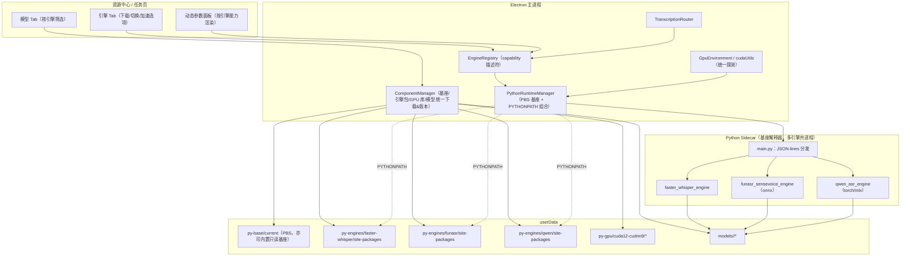

# 三层架构 · 多 ASR 引擎集成技术方案（faster-whisper / FunASR / Qwen-ASR）

> 状态：已评审（决策已确认，待出实施 Plan）
> 日期：2026-06-16
> 分支：`feat/three-layer-p0`（主仓 SmartSub）+ `feat/three-layer-p0`（`buxuku/smartsub-py-engine`）
> 范围：Python 运行时三层化（基座 / 引擎依赖包 / 模型）· 新增 FunASR(SenseVoice) 与 Qwen-ASR 本地引擎 · 跨引擎参数与 GPU 管理 · 无开发者证书分发
> 关联：`main/helpers/pythonRuntime/*`、`main/helpers/engines/*`、`main/helpers/addonLoader.ts`、`smartsub-py-engine/build_engine_package.py`、`docs/superpowers/specs/2026-06-13-multi-engine-design.md`

---

## 0. 结论速览（TL;DR）

针对你提出的 8 个问题，先给一句话结论，详见对应章节：

| #   | 你的问题                         | 结论                                                                                                                                | 章节  |
| --- | -------------------------------- | ----------------------------------------------------------------------------------------------------------------------------------- | ----- |
| 1   | 可行性 / 是否最优                | **可行，且在「无证书 + ≤200MB + 多引擎 + 国内可下载」约束下是最优解**。三层 = PBS 基座(内置) + uv 可重定位引擎包(下载) + 模型(下载) | §2 §3 |
| 2   | FunASR 用 ONNX 还是 PyTorch CUDA | **ONNX Runtime**。SenseVoice-Small 非自回归、CPU 已极快；PyTorch CUDA 多 2–3GB 依赖且收益有限                                       | §6.2  |
| 3   | 不同引擎参数不一致如何管理       | **引擎能力描述符（Capability Descriptor）+ 统一参数中枢 + 各引擎映射器**；UI 按描述符动态渲染                                       | §7    |
| 4   | 不同引擎 GPU 加速如何管理        | **统一 `device=auto` 探测 + 运行时降级 + 实际后端回显**；GPU 运行时库按需下载；复用现有 `cudaUtils`/`GpuEnvironment`                | §8    |
| 5   | 三层改造成本 / 风险              | **中等成本、低风险**。引擎抽象层已就位、无老用户、无 PyInstaller 包袱；主要改造在基座加载 + 下载器多组件化                          | §11   |
| 6   | 基座与依赖更新管理               | **三维版本协调（pythonVersion × enginePackage × protocolVersion）+ 复用现有 manifest/checksum/原子替换/回滚/每日检查**              | §10   |
| 7   | 无开发者证书签名                 | **可行**。与 addon.node 同机理（arm64 ad-hoc + 自下载文件无 quarantine）；下载的原生库追加本地 `codesign -s -` 兜底                 | §9    |
| 8   | 其它需评估事项                   | 冷启动、显存与并发、磁盘清理、隐私离线、国内源、许可证、卸载、可观测性等                                                            | §13   |

**一句话方案**：把当前「PyInstaller 单可执行 sidecar」升级为「App 内置 PBS（python-build-standalone）基座 + 按引擎独立下载的 uv 可重定位依赖包（PYTHONPATH 叠加）+ 按需下载的模型」，在不超过 200MB 主包、不需要开发者证书的前提下，扩展出 faster-whisper / FunASR(SenseVoice) / Qwen-ASR 三条本地引擎线，优先保障 Windows、其次 macOS。

---

## 1. 背景与现状

### 1.1 现状（已逐文件确认）

**主仓 SmartSub（`feat/three-layer-p0`）**

- 转写引擎抽象层已就位：`TranscriptionEngineAdapter`（`main/helpers/engines/types.ts`）、`registry.ts`、`builtinEngine`（whisper.cpp）、`fasterWhisperEngine`、`localCliEngine`。`fileProcessor` 经 router 调度，不再硬编码。
- Python 运行时已成熟：`PythonRuntimeManager`（stdio JSON-lines、ping/transcribe/cancel/shutdown、env 消毒、协议版本区间校验、崩溃 reject）、`PyEngineDownloader`（镜像源回退 github/ghproxy/gitcode、断点续传、SHA256、staging→current 原子替换、previous 备份回滚、ping 自检、每日静默更新检查）。
- **但 sidecar 仍以「PyInstaller 单一可执行」加载**：`resolveEngineCommand()` 返回 `userData/py-engine/current/smartsub-engine[.exe]`；`paths.ts`/`normalizePyEngineLayout` 全部围绕「单二进制 + onedir」假设。
- 加速侧（whisper.cpp）已有完善的 `addonLoader`（CUDA/Vulkan/CoreML/CPU 候选链 + dlopen try/catch 降级 + 会话缓存 + 回显实际后端）。CUDA/Vulkan 包**已是按需下载**，安装包只内置 `addon.node`(CPU 3MB) + `addon.coreml.node`(3MB)。

**引擎仓 smartsub-py-engine（`feat/three-layer-p0`）**

- `main.py` 已是「引擎无关」的协议分发器：`get_engine(name)` 注册表 + `list_engines()`（`find_spec` 惰性探测）+ `ping/preload/transcribe/cancel/shutdown`。新增引擎只需在 `engines/` 加实现并注册。
- **HEAD 已提交「uv 可重定位包」方案**：`build_engine_package.py` 用 `uv pip install --target site-packages` 把依赖装进可重定位顶层目录，产物布局 `main.py + _version.py + engines/ + site-packages/`，发布说明写明「由 App 侧 python-build-standalone 基座 + PYTHONPATH 加载」。
- **工作区已回退回 PyInstaller**（`smartsub-engine.spec` 重现、`_version` 回 0.1.1、删除 `build_engine_package.py`）——即你正在「PBS 三层」与「PyInstaller」之间权衡。**本方案即给出明确选型与迁移路径。**

### 1.2 目标

1. 把 Python 运行能力**三层化**，使「再加一个引擎」成为「加一个依赖包 + 一段适配器」，而非每次重做打包/CI。
2. 引入**国产/中文友好引擎**提升中文识别准确度：FunASR(SenseVoice-Small) 与 Qwen-ASR（本地）。
3. **主包 ≤ 200MB**：基座按平台内置（裁剪后体积可控），引擎依赖包与模型一律在线下载。
4. **无开发者证书**仍能在 Windows / macOS(含 Apple Silicon) / Linux 正常运行。
5. 平台优先级 **Windows > macOS > Linux**（开发以 macOS 为主）。
6. 跨引擎的**参数**与**GPU 加速**有统一、可扩展的管理方式。

### 1.3 用户确认的关键决策

| 决策点              | 选择                                                            |
| ------------------- | --------------------------------------------------------------- |
| Qwen-ASR 交付方式   | **仅本地**（DashScope API 收费，故不走 API；本地 0.6B/1.7B）    |
| 文档范围            | **完整三层 + 三引擎总体方案，分阶段 P0→P1→P2，逐阶段成本/风险** |
| FunASR 集成方式     | **走现有 Python sidecar**（同基座、复用下载/协议）              |
| 平台优先级          | **Windows > macOS > Linux**                                     |
| 主包体积上限        | **≤ 200MB**                                                     |
| PyInstaller 兜底    | **不保留**（当前未发布正式版、无老用户）                        |
| 历史 py-engine 迁移 | **无需**（无老用户）                                            |

### 1.4 非目标（本轮不做）

- 不做 Qwen-ASR / 任何云端 API 引擎（按你的决定，Qwen 仅本地）。
- 不做通用 Python 插件市场；三层只服务 ASR 引擎。
- 不动 whisper.cpp(builtin) 的加载与 ggml 模型语义；它仍是默认与保底引擎。
- 不强求 Qwen 在无独立显卡机器上「好用」（见 §6.3 可行性边界），仅保证「可用 + 明确门槛提示」。
- 不在 P0 引入 sherpa-onnx N-API 路线（仅在 §6.2 附对比备查）。

---

## 2. 总体架构：三层模型

### 2.1 三层定义

```
┌──────────────────────────────────────────────────────────────┐
│ Layer 3  模型层（在线下载，按引擎分目录）                      │
│   whisper-models(ggml) · faster-whisper-models(CT2) ·          │
│   funasr-models(onnx) · qwen-models(safetensors/mlx)           │
├──────────────────────────────────────────────────────────────┤
│ Layer 2  引擎依赖层（在线下载，按引擎独立 site-packages）      │
│   faster-whisper 包 · funasr-onnx 包 · qwen 包（torch 等）     │
│   产物 = uv pip install --target 的可重定位 site-packages      │
├──────────────────────────────────────────────────────────────┤
│ Layer 1  基座层（随 App 按平台内置，可远程覆盖升级）           │
│   python-build-standalone（CPython 3.12，裁剪 stripped）       │
│   提供「能跑任意纯/原生 wheel」的通用 Python 运行能力          │
└──────────────────────────────────────────────────────────────┘
```

- **Layer 1（基座）**：一个可重定位的、与系统隔离的 CPython。**只此一份**，被所有引擎共享。随 App 按平台内置（裁剪后小），并可通过下载器远程覆盖升级。
- **Layer 2（引擎依赖包）**：每个引擎一份独立的 `site-packages`（uv `--target` 产物），含该引擎的全部 Python 依赖（含原生扩展 `.so/.pyd/.dylib`）。**按需下载、独立增删、互不干扰**。
- **Layer 3（模型）**：每个引擎的权重，按需下载，分目录存放，支持国内镜像。

### 2.2 架构图



### 2.3 目录布局（userData）

```
userData/
  py-base/                       # Layer1（若选「下载基座」；内置基座则在 App 资源内）
    current/                     # PBS 解压根：bin/python、lib/python3.12/...
    manifest.json                # pythonVersion、platform、sha256
  py-engines/                    # Layer2：每引擎独立
    faster-whisper/
      site-packages/             # ctranslate2、faster_whisper、av、tokenizers...
      manifest.json              # engine、version、pythonAbi(cp312)、platform、sha256
    funasr/
      site-packages/             # onnxruntime、kaldi-native-fbank、sentencepiece...
      manifest.json
    qwen/
      site-packages/             # torch、transformers、qwen-asr...
      manifest.json
  py-gpu/                        # GPU 运行时库（按需，跨引擎可共享）
    cuda12-cudnn9/               # cuBLAS/cuDNN（faster-whisper、onnxruntime-gpu 共用）
    manifest.json
  sidecar/                       # 引擎源码（main.py + engines/，随包或独立下载）
    current/
  models/
    whisper/                     # ggml（语义不变，沿用 modelsPath）
    faster-whisper/              # CT2（HF 缓存布局）
    funasr/                      # SenseVoice onnx + tokens + cmvn
    qwen/                        # Qwen3-ASR 权重
  py-cache/                      # HF_HOME / MODELSCOPE_CACHE 等
```

> 说明：`sidecar/`（`main.py`+`engines/`）与 Layer2 依赖解耦，便于「同一份 sidecar 源码 + 不同引擎包」组合；也可把 sidecar 源码并进每个引擎包内（更简单）。两种都列在 §11 取舍。

### 2.4 加载链路：基座 + PYTHONPATH 组合

当前 `manager.buildSanitizedEnv()` 会**删除 `PYTHONPATH`**（PyInstaller 自带依赖，无需外部路径）。三层模型下改为**显式构造 `PYTHONPATH`**：

```
command = <py-base>/bin/python            # Windows 为 python.exe
args    = [ <sidecar>/main.py ]
env.PYTHONPATH = <py-engines/<engine>/site-packages>   # 仅当前引擎包
                 (+ <py-gpu/.../lib> 注入 PATH/LD_LIBRARY_PATH/DYLD_*)
env.PYTHONHOME = <py-base>                 # 指向基座，确保 stdlib 定位正确
env.PYTHONNOUSERSITE=1 / PYTHONDONTWRITEBYTECODE=1 / PYTHONUNBUFFERED=1
env.HF_HOME / MODELSCOPE_CACHE = <models/...>
```

关键点：

- **单引擎单 PYTHONPATH**：每次 `ensureStarted(engineId)` 只挂载当前引擎的 `site-packages`，避免 numpy/onnx/torch 跨引擎版本冲突（§4.3）。切换引擎 = 重启 sidecar 换 PYTHONPATH（代价：一次冷启动）。
- **基座隔离**：`PYTHONHOME` 指向 PBS 根，配合 `PYTHONNOUSERSITE`，与用户机器上的系统 Python/conda 完全隔离（沿用现有 env 消毒思路，仅把「删 PYTHONPATH」改成「设受控 PYTHONPATH」）。
- **GPU 库注入**：CUDA/cuDNN 等运行时库目录在 spawn 前注入 `PATH`(win) / `LD_LIBRARY_PATH`(linux) / `DYLD_LIBRARY_PATH`(mac)，与 `addonLoader.setupLibraryPath` 完全同构。

### 2.5 与现有架构的关系

- `EngineRegistry` / `TranscriptionEngineAdapter` **保留并扩展**：新增 `funasr`、`qwen` 两个 adapter，复用 `transcribeShared`（SRT 格式化、语言归一、数值兜底）。
- `PythonRuntimeManager` **保留**，仅改 `resolveCommand`（多引擎、组合 PYTHONPATH）与「当前引擎」感知（见 §11 改造点）。
- `PyEngineDownloader` **泛化**为 `ComponentManager`（见 §10）：把「单一 sidecar 包」扩展为「基座 / 各引擎包 / GPU 库 / 模型」多组件，但下载/校验/原子替换/回滚/镜像回退**逻辑复用**。

---

## 3. 基座层（Layer 1）

### 3.1 选型对比

| 方案                                  | 体积/隔离                  | 跨平台原生 wheel | 无证书可执行             | 多引擎共享  | 结论                                     |
| ------------------------------------- | -------------------------- | ---------------- | ------------------------ | ----------- | ---------------------------------------- |
| **A. python-build-standalone（PBS）** | 可裁剪、强隔离、可重定位   | 直接装官方 wheel | arm64 自带 ad-hoc 签名   | ✅ 一份共享 | **采用**                                 |
| B. PyInstaller 每引擎冻结             | 每引擎重复打包、体积膨胀   | 受 hook 牵制     | 需自行 ad-hoc            | ❌ 各自独立 | 否决（重复、不利多引擎、你已决定不留）   |
| C. 依赖用户系统 Python                | 0 内置                     | 看用户环境       | —                        | —           | 否决（与「开箱即用」定位冲突，依赖地狱） |
| D. 嵌入式 python.org + 首次 pip 安装  | 体积小但首启慢、网络强依赖 | 易踩坑           | mac framework 路径硬编码 | ✅          | 否决（PBS 即其更优替代）                 |

PBS（Astral 维护）专为「预构建后分发到他机」设计：macOS 用 `@executable_path`、Linux 用 `$ORIGIN` RPATH，可重定位；Windows 为标准 shared 构建。这正是「装官方 wheel + 跨机分发」的最佳基座，也是 uv/rye/mise 的底座。

> **为什么不是 PyInstaller**：多引擎场景下 PyInstaller 要么把所有引擎打进一个巨包（与「按需下载、互不干扰」矛盾、体积爆炸），要么每引擎一个冻结包（基座重复 N 份）。而 PBS 是「一份基座 + N 份纯 wheel 目录」，天然契合三层。这也是你 HEAD 提交 uv 方案、放弃 PyInstaller 的根本原因。

### 3.2 内置 vs 下载

按你的意图「基座不大就内置」，结论：

- **基座按平台内置进 App（首选）**：随安装包分发，首次使用引擎时无需先下基座，首启体验最好；并通过 `ComponentManager` 支持「远程覆盖升级」（基座有安全/兼容更新时下载新版到 `userData/py-base/current`，加载时优先用户目录版本，回退内置版本——与 `addonLoader` 的 builtin/userData 双源同构）。
- **下载基座（兜底/备选）**：若实测内置后主包逼近 200MB，则改为「基座也走下载」（首次启用任一 Python 引擎时下载约 20–60MB）。

### 3.3 体积预算（200MB 分析）

- 现状内置仅 `extraResources` ~7MB（addon.node 3MB + coreml 3MB + silero 0.87MB），CUDA/Vulkan 加速包均下载。Electron + 应用代码是主包大头。
- PBS 压缩包：`install_only` ~20–60MB、`install_stripped` ~21MB（压缩）；解压后 `install_only` 偏大（含完整 stdlib/pip/test）。
- **裁剪策略**（目标解压后基座 ≈ 40–70MB）：移除 `test/`、`idlelib`、`tkinter`、`ensurepip`、`lib2to3`、`__pycache__`、静态库与 `.pyc` 等；保留 `ssl`/`ctypes`/`zlib`/`lzma`/`sqlite3`（HF/模型/解压需要）。
- electron-builder **按平台/架构各自出包**，内置的是「当前平台一份基座」，不会叠加。结论：**裁剪基座内置后主包可控在 200MB 内**；附 §15 体积明细表，构建期加体积门禁（超阈值 CI 失败）。

### 3.4 启动与环境隔离

- `manager.ts` 的 `buildSanitizedEnv`：把「删除 PYTHONPATH」改为「设置受控 PYTHONPATH + PYTHONHOME」，其余消毒（清 VIRTUAL*ENV/CONDA*\*、PYTHONNOUSERSITE）保留。
- 冷启动 ping 超时（现 60s + 一次重试）保留；三层下基座是本地解释器、首启更快，反而更稳。
- Windows：spawn 时 `windowsHide:true`（已有）；`python.exe` 控制台句柄隐藏。

### 3.5 跨平台关键点

| 平台             | 基座要点                                                                                 |
| ---------------- | ---------------------------------------------------------------------------------------- |
| Windows(x64)     | PBS `*-pc-windows-msvc-shared`；DLL 搜索路径注入 `PATH`                                  |
| macOS(arm64/x64) | PBS `aarch64/x86_64-apple-darwin`；`@executable_path` 重定位；arm64 需 ad-hoc 签名（§9） |
| Linux(x64)       | PBS `x86_64-unknown-linux-gnu`（非 SIMD 变体，避免老 CPU 崩）；`$ORIGIN` RPATH           |

---

## 4. 引擎依赖层（Layer 2）

### 4.1 包格式

沿用你 HEAD 的 `build_engine_package.py` 思路，每引擎产出**可重定位 site-packages**：

```bash
uv pip install --python <PBS-3.12> --target <out>/site-packages -r requirements.txt
# 清 __pycache__；macOS 用 install_name_tool 校正 dylib id（py-app-standalone 同款处理）
# 打包：tar.gz，顶层即 site-packages/（+ 可选 sidecar 源码）
```

- 用 PBS 解释器本体执行 `uv pip install`，确保 wheel 的 ABI tag（`cp312`、平台 tag）与基座匹配。
- macOS：对含 `@rpath`/绝对路径的 dylib 做 `install_name_tool` 修正，保证脱离构建机可重定位。

### 4.2 每引擎独立包 + 独立 manifest

每个引擎包是独立发布资产 + 独立 `manifest.json`（`engine/version/pythonAbi/platform/sha256/builtAt`），独立校验、独立增删。引擎仓 CI 矩阵从「1 产物 × 4 平台」扩展为「N 引擎 × 4 平台」（§10、§12）。

### 4.3 共享 vs 隔离依赖（关键取舍）

三引擎依赖差异极大且可能冲突（numpy 版本、onnxruntime vs torch、tokenizers）。

- **采用「每引擎独立 site-packages」**：用 PYTHONPATH 隔离，切换引擎重启 sidecar。优点：零冲突、可独立升级/卸载、单引擎包体积可控；缺点：公共库（如 numpy）在多引擎下各存一份（磁盘略冗余，可接受）。
- 否决「单一大 site-packages 共享」：torch 与 onnxruntime 同载、版本互锁，是依赖地狱主因。

### 4.4 依赖矩阵与体积（量级估算，按平台波动）

| 引擎           | 关键依赖                                                                             | CPU 包估算                   | GPU 额外（按需）                                     |
| -------------- | ------------------------------------------------------------------------------------ | ---------------------------- | ---------------------------------------------------- |
| faster-whisper | `ctranslate2`、`faster_whisper`、`av`、`tokenizers`、`onnxruntime`(silero VAD)       | ~80–150MB                    | CUDA12+cuDNN9 运行时 ~1–2GB（`py-gpu`，共享）        |
| FunASR(onnx)   | `onnxruntime`、`kaldi-native-fbank`、`sentencepiece`、`numpy`（+可选 `funasr-onnx`） | ~60–120MB                    | `onnxruntime-gpu`（替换 CPU 版）+ 复用 `py-gpu` CUDA |
| Qwen-ASR(本地) | `torch`、`transformers`、`qwen-asr`/`accelerate`、`numpy`                            | **~1.8–2.8GB**（torch 为主） | CUDA 随 torch 轮子自带；mac 走 MPS/MLX               |

> Qwen 的本地包很大（torch），但**全部走下载**，不进主包，主包 ≤200MB 不受影响。仅在用户主动启用 Qwen 时下载，并明确提示体积与硬件门槛（§6.3）。

---

## 5. 模型层（Layer 3）

- 按引擎分目录（§2.3），互不混放；whisper.cpp 的 `modelsPath`/ggml 语义保持不变。
- 来源与镜像：HuggingFace / ModelScope（国内更快）双源，复用现有镜像回退与 `HF_HOME`/`MODELSCOPE_CACHE` 本地化。SenseVoice、Qwen 在 ModelScope 上是一等公民，国内下载更顺。
- 下载方式：沿用「Node 侧 HTTP Range 并行下载器」（最近提交 `989a5e9`）+ sidecar `preload`（让引擎自身按其缓存布局拉模型，如 faster-whisper 的 CT2 转换）两种，按引擎择优。
- 模型与引擎解耦：模型目录独立于引擎包，升级引擎包不动模型。

---

## 6. 各引擎集成方案

### 6.1 faster-whisper（迁移到三层 + GPU 按需）

- 逻辑不变（`fasterWhisperEngine.ts` 已完善：VAD、抗幻觉、词级时间戳、取消、SRT）。
- 变化点：运行时从「PyInstaller 二进制」改为「基座 python + `py-engines/faster-whisper/site-packages` + main.py」。
- GPU：`ctranslate2` 仅支持 CUDA12/cuDNN9。把 cuBLAS/cuDNN 放入共享 `py-gpu/cuda12-cudnn9`，启用 CUDA 时注入库路径；`device=auto` 失败回退 CPU（已实现降级语义）。

### 6.2 FunASR / SenseVoice-Small（ONNX）—— 问题 2 详答

**模型选择**：SenseVoice-Small（~234M、非自回归 CTC），中文/粤语/英/日/韩俱佳，比 whisper-small 快 5×、比 whisper-large 快 15×，含 ITN、情感、事件标签。ONNX INT8 单文件 ~230MB + tokens + cmvn。

**ONNX vs PyTorch CUDA（结论：ONNX Runtime）**

| 维度        | ONNX Runtime（采用）                         | PyTorch CUDA（否决）    |
| ----------- | -------------------------------------------- | ----------------------- |
| 依赖体积    | 小（onnxruntime + fbank + sentencepiece）    | 大（torch+cuda ~2–3GB） |
| CPU 性能    | 强（该模型非自回归，CPU 已极快）             | 一般且重                |
| GPU 性能    | 够用（onnxruntime-gpu）；小模型 GPU 收益有限 | 略优但不值这个体积      |
| 跨平台/隔离 | 好（与 faster-whisper 同 onnxruntime 生态）  | 复杂                    |
| 与三层契合  | 高（纯下载小包）                             | 低                      |

→ **用 ONNX Runtime**：默认 CPU，N 卡环境可选 `onnxruntime-gpu`（复用 `py-gpu` CUDA）。SenseVoice 这种小而快的模型，CPU INT8 已能满足字幕场景，GPU 仅作可选加速。

**工程要点**

- SenseVoice 单段上限 ~30s，**长音频必须先 VAD 分段**：用 FSMN-VAD 或复用现有 silero VAD（`extraResources/ggml-silero-v6.2.0.bin` 已内置，onnxruntime 可加载 silero onnx），分段后逐段 ASR → 合并 → SRT。
- sidecar 新增 `engines/funasr_sensevoice_engine.py`，注册进 `get_engine`；协议不变（progress/segment 复用）。
- 前处理（fbank→LFR→CMVN）：用 `funasr-onnx` 的 `SenseVoiceSmall` 封装可省去手写前处理；若要极致瘦身可用 `onnxruntime+kaldi-native-fbank+sentencepiece` 裸跑（omote-ai/k2 路线）。**P1 先用 `funasr-onnx`（省事、稳）**，瘦身留作优化。

**附：A/B 备选（不在 P0/P1 采用，备查）**

- B 方案 sherpa-onnx 做 N-API 原生引擎：无需 Python、体积更小、可单文件 addon，但要新 C++/CI 封装、与现有 Python 协议双轨。鉴于你已决定「FunASR 走 Python 层」，列为未来优化项。

### 6.3 Qwen-ASR（本地）—— 可行性与边界

**模型**：Qwen3-ASR（2026-01 发布，Apache-2.0）：1.7B（开源 SOTA，中文 WER ~5.2%）/ 0.6B（端侧友好）。`qwen-asr` Python 包；自回归 LALM（基于 Qwen3-Omni）。

**可行性边界（必须如实告知用户）**

- 依赖重：`torch`+`transformers`，下载量级 ~2–3GB（仅启用时下），权重 0.6B ~1.2GB / 1.7B ~3.5GB。
- 算力门槛：1.7B 实用化基本要 **NVIDIA 8GB+ 显存**；CPU 跑自回归 1.7B 会很慢。0.6B 在中高端 CPU/集显上「能用但不快」。
- 平台适配：
  - Windows(N 卡)：torch + CUDA wheel，最佳路径（优先级 #1，契合）。
  - macOS(Apple Silicon)：torch MPS 或 **MLX** 版（社区有 MLX 实现），可用但需单独包；你主力开发在 mac，P2 重点验证。
  - 无独显机器：默认 0.6B + CPU，UI 明确「慢/建议小模型」。

**策略**

- 把 Qwen 设计为「**重型可选引擎**」：Engines Tab 显式标注体积/硬件要求；下载前二次确认；运行前做显存/平台探测，给出「建议模型档位」。
- 默认推荐 0.6B；1.7B 作为高配选项。
- 失败/超时要有清晰错误与「回退 faster-whisper / whisper.cpp」引导。

> 直白结论：Qwen 本地是「锦上添花的高配选项」，不是主力。中文准确度的**主力性价比之选是 SenseVoice（小快准）**；Qwen 给有 N 卡/Apple Silicon 的高级用户追求极致准确度时使用。

---

## 7. 跨引擎参数管理（问题 3）

**核心思想：引擎能力描述符（Capability Descriptor）+ 统一参数中枢 + 各引擎映射器。**

```typescript
interface EngineParamSpec {
  key: string; // 统一语义键，如 'vadThreshold'
  type: 'number' | 'boolean' | 'enum' | 'string';
  default: unknown;
  range?: [number, number];
  options?: string[]; // enum
  group: 'common' | 'vad' | 'decoding' | 'gpu' | 'advanced';
  i18nKey: string;
}
interface EngineCapability {
  id: TranscriptionEngine; // builtin|fasterWhisper|funasr|qwen|localCli
  params: EngineParamSpec[]; // 该引擎「认识」的参数
  devices: ('auto' | 'cpu' | 'cuda' | 'coreml' | 'mps' | 'mlx' | 'vulkan')[];
  features: {
    wordTimestamps: boolean;
    vad: boolean;
    languageHint: boolean;
    itn: boolean;
  };
  models: 'ggml' | 'ct2' | 'onnx' | 'qwen';
}
```

- **统一 settings 仍是单一事实源**（沿用现有 `store.settings` + `transcribeShared.getVadSettings/getNumericSetting`）。新增 `EngineRegistry.getCapability(id)` 暴露每引擎支持的参数子集。
- **映射器**：每个 adapter 内置 `mapParams(settings) -> engineParams`（faster-whisper 已是此模式：把通用 VAD/抗幻觉键映射到其 sidecar 字段）。FunASR/Qwen 各写自己的映射，不认识的键自动忽略（sidecar 侧白名单透传，已是现状做法）。
- **UI 动态渲染**：任务页/引擎 Tab 的高级参数面板按 `getCapability(currentEngine).params` 动态生成（复用现有 `DynamicParameterInput` 思路），引擎不支持的参数不展示，避免「设了没用」。
- **持久化**：通用键全局存；引擎专属键（如 `funasr.useItn`、`qwen.modelTier`）按引擎命名空间存（`settings.engineParams[engineId]`）。

收益：再加引擎只需提供一份 Capability + 一个 mapParams，UI/存储/校验零改动。

---

## 8. 跨引擎 GPU 加速管理（问题 4）

**统一原则：探测一次（`GpuEnvironment`）→ 各引擎按 `device=auto` 自选后端 → 失败运行时降级 → UI 回显「实际生效后端」。**

### 8.1 加速矩阵

| 引擎           | Windows/Linux(N卡)        | Apple Silicon          | 无独显/兜底 |
| -------------- | ------------------------- | ---------------------- | ----------- |
| whisper.cpp    | CUDA / Vulkan（已实现）   | CoreML/Metal（已实现） | CPU         |
| faster-whisper | CUDA12+cuDNN9（`py-gpu`） | CPU（CT2 无 Metal）    | CPU         |
| FunASR(onnx)   | onnxruntime-gpu(CUDA)     | CoreML EP / CPU        | CPU         |
| Qwen(torch)    | CUDA(torch wheel)         | MPS / MLX              | CPU(慢)     |

### 8.2 机制

- **探测复用**：`cudaUtils.getGpuEnvironment()`（已检测 NVIDIA/CUDA 版本/驱动）+ 平台/arch + Apple Silicon 判定，产出统一 `GpuEnvironment`，供所有引擎与 UI 共用。
- **GPU 运行时库按需下载并共享**：`py-gpu/cuda12-cudnn9` 供 faster-whisper 与 onnxruntime-gpu 复用（一次下载多引擎用）；torch 的 CUDA 走其自带 wheel（随 Qwen 包）。
- **运行时注入**：spawn sidecar 前把 GPU 库目录注入 `PATH`/`LD_LIBRARY_PATH`/`DYLD_LIBRARY_PATH`（与 `addonLoader.setupLibraryPath` 同构）。
- **降级与回显**：每引擎 `device=auto`→失败 catch→降级 CPU；把「请求后端 vs 实际后端」回传 UI（复用 whisper.cpp 的 fallback 通知 UX）。
- **能力声明**：`EngineCapability.devices` 决定引擎 Tab 的「计算设备」下拉只列该引擎支持项（如 faster-whisper 不出现 Metal）。

---

## 9. 签名与无证书分发（问题 7）

### 9.1 为什么现在的 addon.node 能跑（机理）

1. **App 整体未签名**：用户对 `.app` 执行 `xattr -dr com.apple.quarantine` 解除隔离（README/FAQ 已有引导）。未签名 = 无 hardened runtime = **无 library validation**，因此进程可加载任意 ad-hoc 签名的库。
2. **arm64 强制签名，但 ad-hoc 即可**：CI 在 macOS arm64 上编译 `.node` 时，链接器**自动打 ad-hoc 签名**，故下载的 addon.node 能被 dlopen。
3. **App 自下载的文件不带 quarantine**：quarantine 属性由浏览器等设了 `LSFileQuarantineEnabled` 的程序写入；Electron 用 Node https 下载的文件默认**不带** quarantine，故无 Gatekeeper「首次打开」拦截。

### 9.2 三层各层的签名策略

| 组件                  | 形态            | arm64 签名来源               | 风险与兜底                                                                                 |
| --------------------- | --------------- | ---------------------------- | ------------------------------------------------------------------------------------------ |
| 基座 PBS（内置/下载） | 解释器+dylib    | PBS 自带 ad-hoc              | 内置随 App 被用户解隔离；下载版无 quarantine                                               |
| 引擎包 site-packages  | 原生 .so/.dylib | PyPI wheel 多为链接器 ad-hoc | **下载后跑一遍本地 `codesign -s - --force`（递归 ad-hoc 重签）兜底**，确保所有 Mach-O 有效 |
| GPU 库（CUDA/cuDNN）  | dylib           | 上游可能未签                 | 同上：本地 ad-hoc 重签                                                                     |
| sidecar 源码（.py）   | 纯文本          | 不需要                       | 无                                                                                         |

要点：**所有原生库都是被基座 python 进程 dlopen，而该进程无 library validation**，因此 ad-hoc（含本地自签）即可加载，**全程不需要开发者证书**。`codesign -s -`（ad-hoc）是系统自带、免证书操作，App 可在安装组件后自动执行（仅 macОС）。

> 注意：任何对 Mach-O 的 `install_name_tool` 改写会使原签名失效——所以「先修 dylib id，再 ad-hoc 重签」的顺序很重要（构建期修，安装期重签兜底）。

### 9.3 Windows / Linux

- Windows：无强制签名；主要风险是 **Defender/杀软误报**（尤其下载的 .pyd/.dll）。缓解：不使用 UPX、走 HTTPS 官方/镜像源、SHA256 校验、必要时引导加白；与现有 CUDA 包下载策略一致。
- Linux：无签名问题；注意 glibc 兼容（PBS 选 `unknown-linux-gnu`、CI 用 ubuntu-22.04）。

---

## 10. 基座与依赖更新管理（问题 6）

### 10.1 三维版本协调

```
兼容关系：engine_package 必须匹配  (pythonAbi=cp312) × (platform) × (protocolVersion 区间)
                                    ↑ 基座决定        ↑ 平台      ↑ sidecar 协议（已有区间校验）
```

- 引擎包 `manifest.json` 记录 `pythonAbi`/`platform`/`protocolVersion`；基座 `manifest.json` 记录 `pythonVersion`。
- 安装/启用引擎包前校验：`engine.pythonAbi == base.cp` 且 `protocol ∈ [MIN,MAX]`（**协议区间校验已存在**，扩展加 ABI 校验即可）。不匹配→提示「请先升级基座 / SmartSub」。

### 10.2 复用现有更新基建（几乎零新增）

现有 `PyEngineDownloader` 已具备：镜像源回退、断点续传、SHA256、staging→current 原子替换、previous 备份 + 失败回滚、ping 自检、`protocolVersion` 区间校验、每日静默检查（`maybeAutoCheckPyEngineUpdate`，以 checksums 哈希为 rolling-latest 更新信号）。

→ **泛化为 `ComponentManager`**：把上述能力参数化到「组件类型」（base / engine:<id> / gpu:<id> / model:<id>），每组件独立 manifest/checksum/目录/原子替换/回滚。逻辑复用，工作量主要是「从单组件改多组件 + 各自 URL/目录映射」。

### 10.3 升级策略

- **基座**：低频，随安全/兼容需要；下载新版到 `py-base/current`，加载优先用户版、回退内置版。
- **引擎包**：跟随引擎仓 rolling `latest`，每日静默检查→「有新版」提示，用户手动更新（沿用现状，不自动下大包）。
- **模型**：用户主动；不随引擎升级而动。
- **原子性与回滚**：每组件升级 = 备份→替换→自检（ping/小样转写）→失败回滚（已实现，推广到各组件）。

---

## 11. 改造成本与风险（问题 5）

### 11.1 改造点清单（主仓）

| 区域                               | 改动                                                                        | 量级 |
| ---------------------------------- | --------------------------------------------------------------------------- | ---- |
| `pythonRuntime/index.ts`           | `resolveEngineCommand`→按当前引擎组合「基座 python + main.py + PYTHONPATH」 | 中   |
| `pythonRuntime/manager.ts`         | `buildSanitizedEnv` 改为设受控 PYTHONPATH/PYTHONHOME；按引擎重启            | 小   |
| `pythonRuntime/paths.ts`           | 从「单二进制路径」改为「基座/引擎包/GPU/模型」多目录解析 + 多 manifest      | 中   |
| `downloader.ts`→`ComponentManager` | 单组件→多组件（base/engine/gpu/model），URL/目录/manifest 参数化            | 中   |
| `engines/registry.ts` + 新 adapter | 加 `funasr`、`qwen` adapter + Capability 描述符                             | 中   |
| GPU 注入                           | spawn 前注入 CUDA/cuDNN 库路径（复用 setupLibraryPath 思路）                | 小   |
| 资源中心 UI                        | 引擎 Tab 多引擎卡片、动态参数面板、体积/硬件提示                            | 中   |
| 引擎仓 CI                          | 单产物→「基座(可选) + N 引擎 × 4 平台」矩阵 + manifest/checksum             | 中   |
| 基座内置                           | electron-builder extraResources 加基座 + 裁剪脚本 + 体积门禁                | 中   |

### 11.2 成本评估

- **总体中等**。最大的有利因素：①引擎抽象层、Python 运行时、下载/更新基建**已全部就位且成熟**；②**无老用户、无 PyInstaller 兼容包袱**——可直接切换基座方案，不需双轨/迁移代码。
- 真正的「新东西」集中在：基座加载（PYTHONPATH/PYTHONHOME 组合）、下载器多组件化、两个新引擎适配器、CI 矩阵扩展、基座内置与裁剪。

### 11.3 风险矩阵

| 风险                             | 等级 | 规避                                                                  |
| -------------------------------- | ---- | --------------------------------------------------------------------- |
| 基座 PYTHONHOME/PYTHONPATH 配错  | 中   | 早期搭最小可跑链路（基座+faster-whisper）打通；smoke `--package` 模式 |
| 引擎包 ABI/平台不匹配            | 中   | manifest ABI 校验 + 启动前拦截 + 清晰提示                             |
| Qwen 体积/算力超预期             | 中   | 设为重型可选；硬件探测；默认 0.6B；失败回退                           |
| macOS arm64 下载库签名失效       | 中   | 安装后 `codesign -s -` 递归 ad-hoc 兜底（§9）                         |
| 200MB 预算被基座顶破             | 中   | 裁剪 stripped + 体积门禁；兜底改「下载基座」                          |
| Windows 杀软误报下载的 .pyd/.dll | 低   | 官方/镜像源 + SHA256 + 不 UPX + 加白引导                              |
| 切换引擎冷启动慢                 | 低   | 进度提示 + 预热 ping；同引擎不重启                                    |
| 国内下载慢/失败                  | 低   | 已有 ghproxy/gitcode 回退 + Range 并行 + 断点续传                     |

---

## 12. 分阶段实施（P0 / P1 / P2）

### P0 —— 基座三层化（PyInstaller → PBS）+ faster-whisper 跑通新机制

**目标**：把现有 faster-whisper 从「PyInstaller 二进制」切到「内置 PBS 基座 + 下载引擎包 + PYTHONPATH」，端到端跑通，作为三层地基。

- 交付：引擎仓 `build_engine_package.py` 复活并定稿（uv `--target`）+ CI 出「基座(可选内置物料) + faster-whisper 包」；主仓基座内置 + `ComponentManager` 雏形 + `resolveCommand` 改造 + manager PYTHONPATH。
- 验收：四平台（重点 Win/mac）下载 faster-whisper 包 → tiny 模型转写出 SRT；体积门禁通过；取消/进度/降级不回归。
- 成本：中；风险：中（地基，最值得投入）。

### P1 —— FunASR / SenseVoice-Small（ONNX）

**目标**：新增中文性价比主力引擎。

- 交付：引擎仓 `funasr` 包（onnxruntime + funasr-onnx）+ `funasr_sensevoice_engine.py`（VAD 分段→ASR→SRT）；主仓 `funasr` adapter + Capability + 模型下载（ModelScope 优先）+ 引擎 Tab。
- 验收：长音频（>30s）分段正确、中文/粤语准确度优于 whisper-small；CPU 即可流畅。
- 成本：中；风险：中（VAD 分段与时间戳拼接是重点）。

### P2 —— Qwen-ASR（本地，重型可选）

**目标**：为高配用户提供极致中文准确度。

- 交付：引擎仓 `qwen` 包（torch/transformers/qwen-asr）+ `qwen_asr_engine.py`；主仓 `qwen` adapter + 硬件探测/档位推荐 + 体积与门槛提示。**默认档位 0.6B**；1.7B 高配可选。
- mac MLX 变体：**可选（非必做）**，作为 Apple Silicon 的加速优化项，时间允许再做。
- 验收：Win(N 卡) 1.7B、mac(Apple Silicon) 0.6B 跑通；无独显走 0.6B CPU 并明确提示；失败回退。
- 成本：高（torch 多平台 + 显存管理）；风险：中（体积/算力，已设边界与回退）。

---

## 13. 其它需评估事项（问题 8）

1. **音频前处理统一**：各引擎对采样率/声道要求不同（多为 16k 单声道）；复用现有 `audioProcessor`/ffmpeg 统一转码，避免每引擎重复。
2. **磁盘占用与清理**：三层 + 多引擎 + 多模型可达数 GB；提供「按组件查看占用 / 一键卸载引擎 / 清理模型缓存」（卸载引擎删 `py-engines/<id>` + 对应模型可选）。
3. **首启与冷启动**：基座本地化后冷启更快；切换引擎重启 sidecar 要有「准备中」反馈与预热 ping。
4. **显存与并发**：Qwen/大模型并发会爆显存；任务队列对重型引擎限并发=1，给出排队提示。
5. **隐私与离线**：三引擎全本地，强调「数据不出端」（相对 Qwen API 的卖点）；首启/下载需联网，转写离线。
6. **国内下载源**：引擎包/GPU 库/模型全部要有 ghproxy/gitcode/ModelScope 镜像；沿用现有源回退。
7. **模型许可证**：SenseVoice、Qwen3-ASR 均 Apache-2.0（可商用）；whisper.cpp/ggml 维持现状；文档列许可证。
8. **可观测性**：每引擎转写日志含「引擎/设备/模型/耗时/降级原因」；`addonLoadHistory` 式的引擎加载历史便于排障。
9. **协议演进**：新引擎若需新事件（如 funasr 的情感/事件标签）走 `protocolVersion` +1 + 区间校验（已具备）。
10. **Windows 长路径**：site-packages 路径深，注意 `MAX_PATH`；userData 路径尽量短，必要时启用长路径。
11. **whisper.cpp 永远保底**：任何 Python 引擎不可用时，UI 引导回退内置 whisper.cpp，保证「永远能出字幕」。
12. **i18n**：新引擎/参数/提示全部中英双语（沿用 `check-i18n` 门禁）。

---

## 14. 测试策略

| 层级     | 内容                                                                           |
| -------- | ------------------------------------------------------------------------------ |
| 引擎仓   | `smoke_test.py --package`：对「基座 + 引擎包」组合做 ping + fake/tiny 转写     |
| 主仓单元 | `resolveCommand` PYTHONPATH 组合、ABI/协议校验、ComponentManager 原子替换/回滚 |
| 集成     | DevTools IPC：下载基座/引擎包 → 切换 → ping → 小模型转写                       |
| E2E 冒烟 | Win/mac：faster-whisper / SenseVoice / Qwen(有卡) 各出 SRT；降级路径           |
| 体积门禁 | CI 校验主包 ≤200MB（基座裁剪后）                                               |
| 回归     | whisper.cpp(builtin) + ggml 全程不受影响                                       |

---

## 15. 附录：体积与依赖明细（待 P0 实测填充）

| 组件                      | 形态 | 估算（解压） | 分发方式         |
| ------------------------- | ---- | ------------ | ---------------- |
| 主应用（Electron+代码）   | 内置 | 现状基础     | 安装包           |
| PBS 基座（裁剪 stripped） | 内置 | ~40–70MB     | 安装包（按平台） |
| faster-whisper 引擎包     | 下载 | ~80–150MB    | 引擎仓 release   |
| FunASR(onnx) 引擎包       | 下载 | ~60–120MB    | 引擎仓 release   |
| Qwen 引擎包（torch）      | 下载 | ~1.8–2.8GB   | 引擎仓 release   |
| GPU 库（CUDA12+cuDNN9）   | 下载 | ~1–2GB       | 共享 `py-gpu`    |
| 模型（按引擎）            | 下载 | 0.2–3.5GB/个 | HF/ModelScope    |

> 目标：**主包（应用 + 内置基座）≤ 200MB**；其余全部按需下载。P0 完成后用真实构建产物回填本表并设 CI 门禁。

---

## 评审结论（已确认）

评审通过，以下 6 项决策已锁定，实施 Plan 据此展开：

| #   | 决策点              | 结论（已确认）                                                                            |
| --- | ------------------- | ----------------------------------------------------------------------------------------- |
| 1   | 基座内置 vs 下载    | **裁剪基座内置进 App**；实测超 200MB 才改为下载                                           |
| 2   | 基座升级策略        | **内置 + 可远程升级双源**（加载优先 `userData/py-base/current`，回退内置）                |
| 3   | 依赖隔离            | **每引擎独立 site-packages**；接受「切换引擎一次冷启动」代价                              |
| 4   | FunASR 前处理       | **P1 用 `funasr-onnx`**（省事稳妥；裸 onnxruntime 瘦身留作后续优化）                      |
| 5   | Qwen 默认档位 / MLX | **默认 0.6B**；**MLX 变体为可选，非 P2 必做项**                                           |
| 6   | GPU 库共享          | **`py-gpu` 共享一份 CUDA12/cuDNN9**（faster-whisper 与 onnxruntime-gpu 共用，需版本对齐） |

下一步：据本设计产出逐 Task 的实施 Plan（`docs/superpowers/plans/2026-06-16-three-layer-p0.md` 起，按 P0→P1→P2 拆分）。
